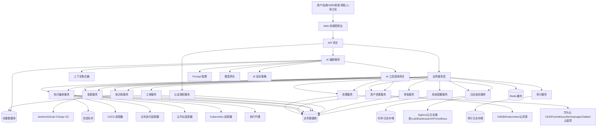
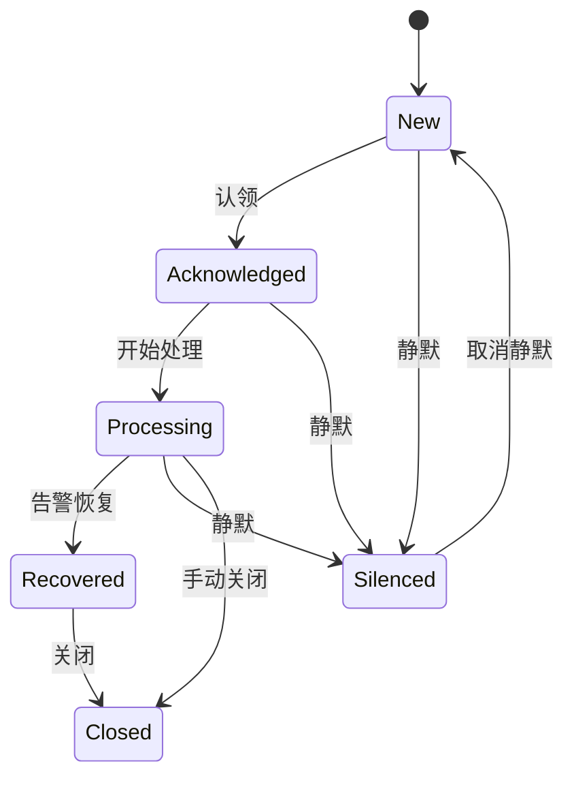
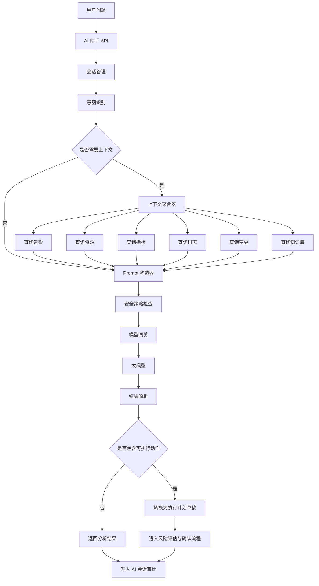
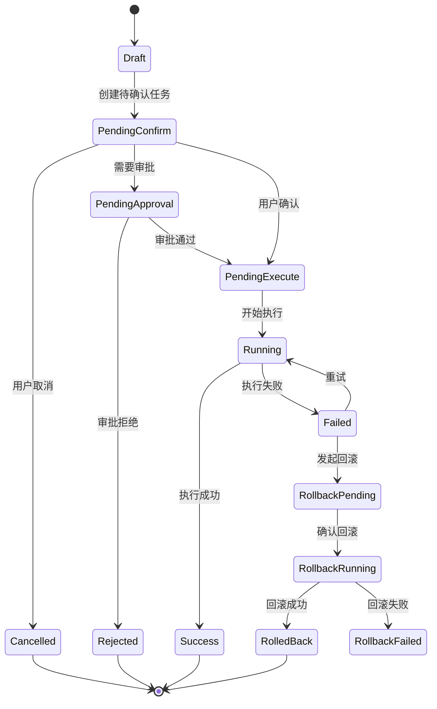
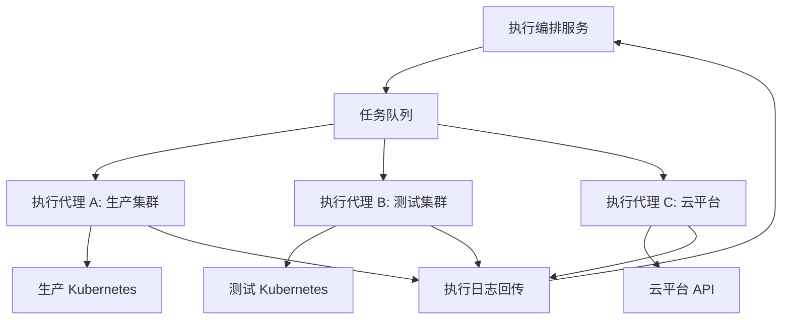
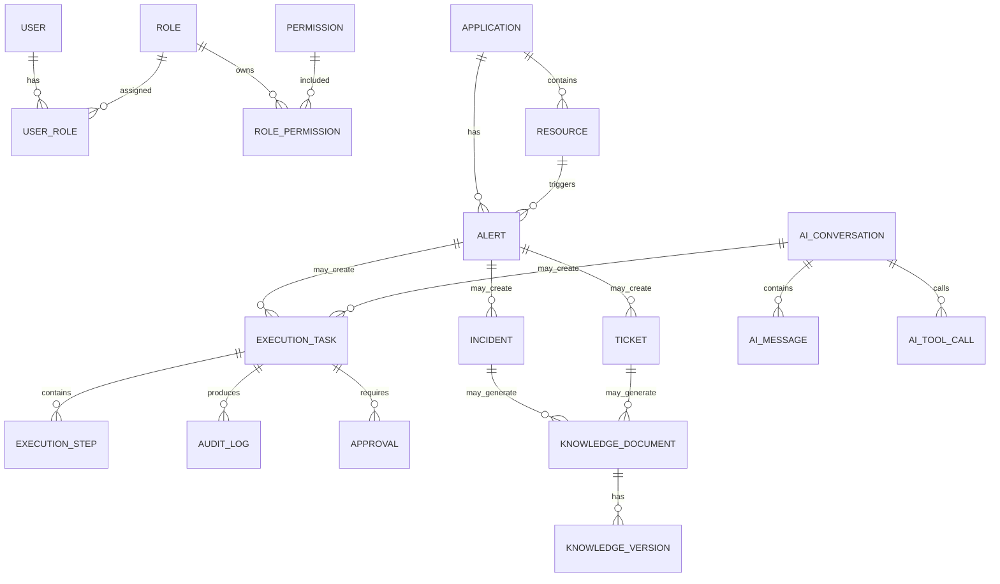
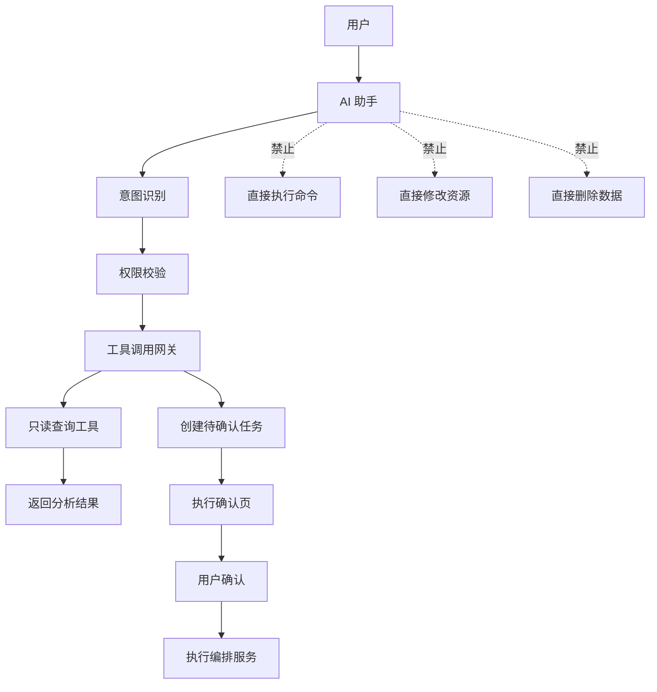
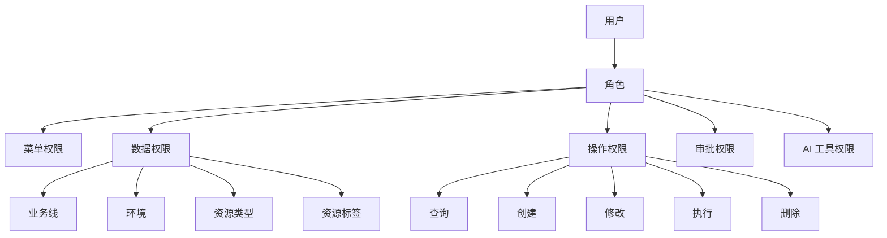
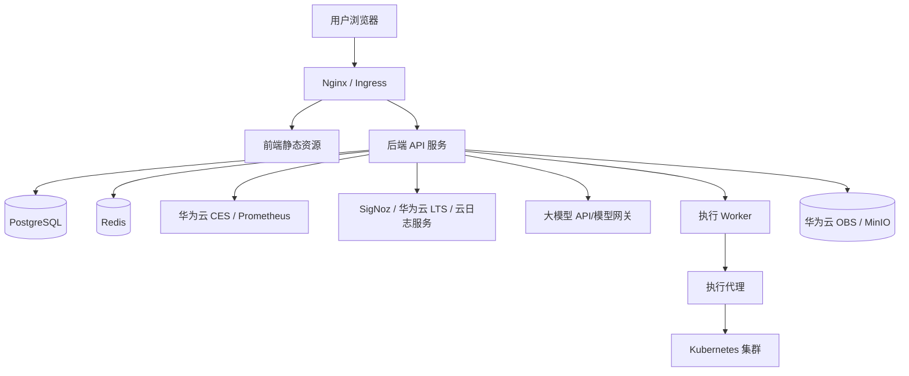
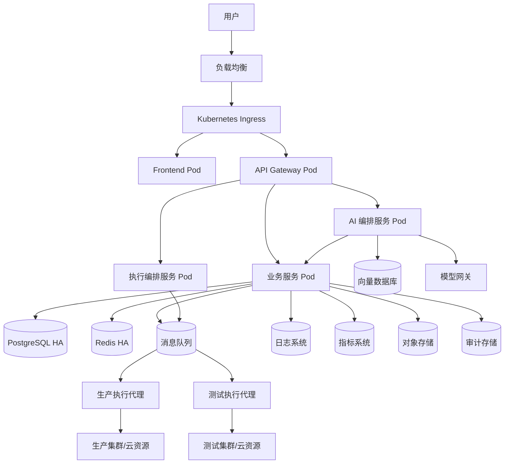

# AI 运维平台技术架构设计

## 1. 文档概述

### 1.1 文档目的

本文档基于《AI 运维平台项目工程需求文档》《AI 运维平台信息架构》《AI 运维平台页面原型》《AI 运维平台核心业务流程图》，对 AI 运维平台进行技术架构设计。

本文档重点解决以下问题：

- 平台整体技术架构如何分层。
- 核心服务如何拆分。
- AI 能力如何安全接入运维流程。
- 自动化执行如何做到可控、可审计、可回滚。
- 权限、审批、审计如何贯穿全链路。
- 外部监控、日志、CMDB、Kubernetes、云平台如何集成。
- 第一阶段架构如何落地，后续如何扩展。

### 1.2 架构目标

AI 运维平台的技术架构目标如下：

- 建立统一的运维操作入口。
- 支持多源运维数据接入和统一建模。
- 支持 AI 对告警、日志、指标、资源、变更和知识库进行综合分析。
- 支持 AI 生成建议和执行计划，但高风险动作必须人工确认。
- 支持自动化执行、实时日志、失败重试和回滚。
- 支持 RBAC 权限、数据权限、操作权限和 AI 工具权限。
- 支持全链路审计。
- 支持模块化扩展和插件化集成。
- 支持高可用、可观测和安全合规。

### 1.3 核心架构原则

- 前后端分离。
- 服务职责清晰。
- 数据访问统一走服务层，不允许前端或 AI 直接访问底层系统。
- AI 只负责分析、建议和计划生成，执行必须通过执行中心。
- 所有工具调用必须继承当前用户身份权限。
- 所有执行动作必须经过风险评估和确认流程。
- 所有关键操作必须审计。
- 外部系统通过适配器接入，避免业务代码绑定具体厂商。
- 第一阶段优先采用 DDD 模块化单体架构，后续可按限界上下文演进为独立服务。

## 2. 总体架构

### 2.1 架构分层

平台整体分为八层：

1. 用户访问层。
2. 前端应用层。
3. API 网关层。
4. 业务服务层。
5. AI 编排层。
6. 集成适配层。
7. 执行控制层。
8. 数据存储层。

### 2.2 总体架构图



### 2.3 架构说明

- Web 前端只与 API 网关通信。
- API 网关负责鉴权、路由、限流、请求追踪和基础审计。
- 业务服务负责平台核心业务规则。
- AI 编排服务不直接操作基础设施，只能通过 AI 工具调用网关访问受控工具。
- 执行编排服务负责所有真实操作动作。
- 执行代理负责在目标环境执行具体命令、脚本或 API 调用。
- 集成适配器负责屏蔽外部系统差异。
- 审计服务记录所有关键行为。

## 3. 技术选型与 DDD 架构方案

### 3.1 技术架构决策

平台采用“Go 后端 + Vue 前端 + DDD 领域驱动 + 插件化适配器 + 异步执行 Worker”的技术架构。

核心决策如下：

- 后端以 Go 作为主开发语言，承载领域模型、业务服务、接口服务、任务编排、权限审计和外部系统适配。
- 前端采用 Vue 3 技术栈建设统一 Web 控制台。
- 后端从项目初始阶段即采用 DDD 领域驱动设计，按限界上下文组织代码和模型。
- AI 编排能力优先作为后端领域模块建设，后续可根据复杂度拆分为独立 AI 服务或 Python Worker。
- 指标、日志、云资源、Kubernetes、CI/CD 等外部系统均通过适配器接入，平台内部不直接绑定具体厂商 API。
- 自动化执行通过执行编排服务和执行代理完成，禁止 AI 或前端直接调用真实执行接口。
- 审计、权限、风险评估和人工确认贯穿所有关键操作链路。

### 3.2 技术栈选型

| 层次 | 技术选型 | 架构定位 |
| --- | --- | --- |
| 前端框架 | Vue 3 + TypeScript + Vite | Web 控制台基础框架 |
| 前端状态管理 | Pinia | 用户信息、权限、筛选条件、全局状态管理 |
| 前端路由 | Vue Router | 页面路由、菜单权限、路由守卫 |
| UI 组件库 | Element Plus / Naive UI | 管理后台表格、表单、弹窗、布局组件 |
| 后端语言 | Go | 核心领域模型、应用服务、API、Worker、适配器 |
| Web 框架 | Gin / Fiber / Echo | HTTP API 服务 |
| ORM / SQL | Ent / GORM / sqlc | 数据访问层；复杂场景可优先 sqlc 或 Ent |
| 数据库 | PostgreSQL | 业务数据、权限数据、任务数据、知识库元数据 |
| 缓存 | Redis | 缓存、分布式锁、限流、会话、临时状态 |
| 消息队列 | Redis Stream / NATS | 异步任务、执行队列、通知队列、事件投递 |
| 指标适配 | Huawei CES Adapter / Prometheus Adapter | 统一指标查询接口 |
| 日志适配 | SigNoz Adapter / Huawei LTS Adapter / Cloud Log Adapter | 统一业务日志查询接口 |
| 平台日志 | Zap / Zerolog + OpenTelemetry | 平台自身日志、链路追踪、运行观测 |
| 向量检索 | PostgreSQL + pgvector | 知识库向量化与基础 RAG 检索 |
| 对象存储 | Huawei OBS / MinIO | 附件、报告、执行产物存储 |
| 部署方式 | Docker Compose / Kubernetes | 本地开发与生产部署 |

### 3.3 前端架构方案

前端采用 Vue 3 + TypeScript + Vite 构建单页管理后台。

#### 3.3.1 前端模块划分

```text
web/
├── src/
│   ├── api/
│   ├── assets/
│   ├── components/
│   ├── layouts/
│   ├── router/
│   ├── stores/
│   ├── views/
│   ├── permissions/
│   ├── utils/
│   └── types/
```

#### 3.3.2 前端核心能力

- 基于路由的页面组织。
- 基于菜单权限的动态路由。
- 基于角色和权限的按钮级控制。
- 统一 API 请求封装。
- 统一错误处理。
- AI 对话流式展示。
- 执行日志实时展示。
- 告警、任务、审批通知提醒。

#### 3.3.3 前端页面模块

| 模块 | 页面 |
| --- | --- |
| 首页 | 驾驶舱、全局健康概览、待办任务 |
| AI 运维助手 | 会话页、会话历史、上下文引用、推荐操作 |
| 告警中心 | 告警列表、告警详情、告警分析 |
| 资源与应用 | 应用列表、应用详情、资源列表、资源详情 |
| 日志与指标 | 日志查询、指标查询、AI 分析结果 |
| 自动化执行 | 任务列表、执行确认、任务详情、执行日志 |
| 知识库 | 文档列表、文档详情、文档编辑 |
| 审计中心 | 操作审计、AI 审计、执行审计 |
| 系统管理 | 用户、角色、权限、集成配置、AI 配置 |

### 3.4 后端架构方案

后端采用 Go + DDD 分层架构。

后端逻辑按领域上下文组织，而不是按 Controller、Service、DAO 的技术分层简单堆叠。每个领域模块内部保持完整的领域模型、应用服务、仓储接口和基础设施实现。

后端运行形态包括：

- API Server：处理前端 HTTP 请求、鉴权、业务用例编排。
- Worker：处理异步任务、执行任务、资源同步、通知、知识向量化。
- Scheduler：处理定时任务，例如资源同步、告警归并、审计归档。
- Agent：部署在目标环境或可访问目标环境的位置，负责实际执行动作。

### 3.5 DDD 领域驱动架构

平台从初始阶段采用 DDD 领域驱动设计。

推荐架构形态：

```text
DDD 模块化单体 + 异步 Worker + 插件化适配器
```

该架构不是传统大单体，而是边界清晰的模块化单体。每个领域模块拥有独立的领域模型、应用服务、仓储接口和基础设施实现。后续当某个领域需要独立扩展时，可按限界上下文拆分为独立服务。

#### 3.5.1 DDD 限界上下文划分

| 限界上下文 | 核心职责 |
| --- | --- |
| Identity & Access | 用户、角色、权限、数据范围、AI 工具权限；当前已完成 Identity 核心数据模型落库与只读查询基础能力 |
| Alert | 告警接入、告警聚合、告警状态流转 |
| Asset | 应用、资源、云资源、Kubernetes 资源、标签 |
| Observability | 日志查询、指标查询、异常聚合 |
| AI Assistant | 会话、上下文聚合、工具调用、模型调用、安全策略 |
| Execution | 执行任务、执行步骤、执行确认、回滚、执行日志 |
| Approval | 审批规则、审批单、审批记录 |
| Audit | 操作审计、AI 审计、执行审计、权限审计 |
| Knowledge | 知识文档、分类、标签、向量化、AI 引用 |
| Integration | Huawei CES、SigNoz、Huawei LTS、Kubernetes、云平台等外部系统适配配置 |
| Notification | 企业微信、钉钉、飞书、邮件、Webhook |

#### 3.5.2 Go 项目目录建议

```text
aiops/
├── cmd/
│   ├── api/
│   └── worker/
├── internal/
│   ├── identity/
│   │   ├── domain/
│   │   ├── application/
│   │   ├── infrastructure/
│   │   └── interfaces/
│   ├── alert/
│   ├── asset/
│   ├── observability/
│   ├── aiassistant/
│   ├── execution/
│   ├── approval/
│   ├── audit/
│   ├── knowledge/
│   ├── integration/
│   └── notification/
├── pkg/
│   ├── errors/
│   ├── logger/
│   ├── config/
│   └── transport/
├── migrations/
├── deployments/
└── web/
```

#### 3.5.3 单个领域模块内部结构

```text
internal/execution/
├── domain/
│   ├── entity/
│   ├── valueobject/
│   ├── service/
│   ├── repository.go
│   └── event.go
├── application/
│   ├── command/
│   ├── query/
│   └── service.go
├── infrastructure/
│   ├── persistence/
│   ├── adapter/
│   └── eventbus/
└── interfaces/
    ├── http/
    └── worker/
```

#### 3.5.4 分层职责

| 层 | 职责 |
| --- | --- |
| domain | 领域实体、值对象、领域服务、领域事件、仓储接口 |
| application | 用例编排、事务控制、权限校验、调用领域对象 |
| infrastructure | 数据库、外部 API、消息队列、云服务适配 |
| interfaces | HTTP Handler、Worker Handler、DTO 转换 |

#### 3.5.5 DDD 与后续微服务拆分关系

当某个领域上下文需要独立扩展时，可以按模块拆分为独立服务。

优先可拆分模块：
- AI Assistant。
- Execution。
- Alert。
- Audit。
- Observability。

拆分前后保持领域接口稳定，减少业务代码重构成本。

### 3.6 观测系统适配边界

AI 运维平台不替代业务系统已有的监控、日志和链路追踪系统，而是在平台内部提供统一查询抽象，通过适配器对接不同外部系统。

#### 3.6.1 指标查询适配

```text
MetricQueryProvider
├── HuaweiCESMetricProvider
├── PrometheusMetricProvider
└── CustomMetricProvider
```

平台内部依赖统一的指标查询接口，不直接依赖华为云 CES 或 Prometheus 的具体 API。

#### 3.6.2 日志查询适配

```text
LogQueryProvider
├── SigNozLogProvider
├── HuaweiLTSLogProvider
├── CloudLogProvider
├── LokiLogProvider
└── ElasticsearchLogProvider
```

业务系统日志继续保留在现有日志系统中。AI 运维平台只负责统一查询、聚合、展示和提供 AI 分析上下文。

#### 3.6.3 平台自身可观测性

AI 运维平台自身需要独立记录：

- 平台运行日志。
- API 访问日志。
- AI 调用日志。
- 执行任务日志。
- 审计日志。
- 链路追踪数据。

平台自身日志可通过 OpenTelemetry 接入 SigNoz 或云日志服务，审计日志应单独存储并限制修改权限。

## 4. 服务模块设计

### 4.1 服务模块总览

| 服务模块 | 核心职责 |
| --- | --- |
| API 网关 | 统一入口、鉴权、路由、限流、请求追踪 |
| 用户权限服务 | 用户、角色、权限、数据范围、登录认证 |
| 告警服务 | 告警接入、聚合、状态流转、AI 分析入口 |
| 资产资源服务 | 应用、资源、拓扑、标签、状态同步 |
| 日志指标服务 | 日志查询、指标查询、异常聚合 |
| AI 编排服务 | 上下文聚合、Prompt、模型调用、工具调用、安全策略 |
| 执行编排服务 | 执行计划、任务状态、步骤编排、确认、回滚 |
| 执行代理服务 | 在目标环境执行命令、脚本、K8s 操作或云 API |
| 变更服务 | 变更单、发布计划、风险分析、发布观察 |
| 工单服务 | 工单流转、评论、关联对象 |
| 知识库服务 | 文档管理、向量化、知识检索、AI 引用 |
| 审批服务 | 审批规则、审批单、审批记录 |
| 审计服务 | 操作审计、AI 审计、执行审计、权限审计 |
| 集成配置服务 | 外部系统配置、凭据管理、连接测试 |
| 通知服务 | 企业微信、钉钉、飞书、邮件通知 |

### 4.2 API 网关

#### 4.2.1 职责

- 统一 API 入口。
- 认证鉴权前置处理。
- 请求路由。
- 限流和熔断。
- 请求 ID 注入。
- 访问日志记录。
- 基础审计事件生成。

#### 4.2.2 关键能力

- JWT 或 Session 鉴权。
- SSO 接入。
- RBAC 权限拦截。
- API 级别限流。
- IP 白名单。
- 请求 TraceId 生成。

### 4.3 用户权限服务

#### 4.3.1 职责

- 用户管理。
- 角色管理。
- 权限管理。
- 菜单权限。
- 数据权限。
- 操作权限。
- AI 工具调用权限。
- 企业身份源接入，包括 LDAP、Active Directory 域、OAuth2、OIDC 和企业 SSO。
- 登录安全策略，包括登录审计、失败次数限制、账号锁定、token 吊销和 refresh token 轮换。

#### 4.3.2 权限模型

```text
User -> UserRole -> Role -> RolePermission -> Permission
User -> Organization / BusinessLine
Permission -> MenuPermission / DataPermission / ActionPermission / AiToolPermission
ExternalIdentity -> User
IdentityProvider -> LDAP / AD / OAuth2 / OIDC / SSO
```

#### 4.3.3 权限校验维度

| 权限类型 | 示例 |
| --- | --- |
| 菜单权限 | 是否能访问告警中心 |
| 数据权限 | 是否能查看生产环境支付业务线 |
| 操作权限 | 是否能重启服务、扩容、回滚 |
| 审批权限 | 是否能审批高风险任务 |
| AI 工具权限 | 是否允许 AI 代表用户查询日志、创建任务 |
| 身份源权限 | 是否允许来自指定 LDAP / AD 组织单元的用户登录平台 |

#### 4.3.4 企业 LDAP / AD 域登录接入设计

企业内部登录优先支持 LDAP / Active Directory 域账号，目标是让平台账号体系与企业已有身份源打通，同时保留平台内的角色、数据范围和 AI 工具权限控制。

接入原则：

- LDAP / AD 只作为身份认证与基础用户信息来源，不直接替代平台授权模型。
- 用户登录成功后，平台仍签发自身 JWT，后续 API 鉴权继续走平台统一鉴权中间件。
- 外部用户首次登录时可按策略自动创建或绑定平台用户。
- 平台角色、数据权限、操作权限、AI 工具权限由平台内维护，可通过 LDAP 组映射进行初始赋权。
- 生产环境必须使用 LDAPS 或 StartTLS，禁止明文传输账号密码。
- LDAP 绑定账号、搜索密码等凭据必须加密存储，不进入日志、审计参数和 AI Prompt。

推荐登录流程：

```text
用户提交 username/password
  -> Identity AuthService 判断登录方式
  -> LDAP/AD Provider 使用服务账号搜索用户 DN
  -> LDAP/AD Provider 使用用户 DN + 密码执行 bind 校验
  -> 读取 cn/mail/displayName/memberOf/department 等属性
  -> 绑定或自动创建平台 User
  -> 根据 LDAP 组映射平台角色和组织
  -> 平台签发 access_token / refresh_token
  -> 写入登录审计
```

推荐数据模型补充：

```text
IdentityProvider
- provider_id
- type: local / ldap / ad / oauth2 / oidc / sso
- name
- enabled
- config_encrypted
- priority

ExternalIdentity
- user_id
- provider_id
- external_subject
- external_username
- external_email
- external_groups
- last_login_at

IdentityGroupMapping
- provider_id
- external_group
- role_id
- business_line
- environment_scope
```

LDAP / AD 关键配置：

| 配置项 | 说明 |
| --- | --- |
| server_url | LDAP / LDAPS 地址，例如 `ldaps://ad.example.com:636` |
| bind_dn / bind_password | 用于搜索用户的服务账号，密码加密存储 |
| base_dn | 用户搜索根 DN |
| user_filter | 用户过滤条件，例如 `(sAMAccountName={username})` 或 `(uid={username})` |
| group_filter | 用户组过滤条件，用于角色映射 |
| attributes | 需要同步的用户属性，例如 cn、mail、displayName、memberOf |
| tls_config | CA、证书校验、StartTLS 开关 |
| auto_create_user | 是否允许首次登录自动创建平台用户 |
| group_role_mapping | LDAP / AD 组到平台角色的数据映射 |

安全要求：

- 登录失败统一返回“用户名或密码错误”，避免暴露用户是否存在。
- LDAP 超时、连接失败应有清晰内部日志，但对外不暴露目录结构和服务器信息。
- 支持本地管理员账号作为 break-glass 应急登录方式，但必须强密码、限制来源 IP 并单独审计。
- LDAP 组同步只做授权建议，最终高风险操作仍以平台权限校验结果为准。
- 对 AD 域账号禁用、离职、组变更应支持定时同步或登录时增量刷新。

### 4.4 告警服务

#### 4.4.1 职责

- 接收外部告警。
- 告警标准化。
- 告警去重和聚合。
- 告警状态流转。
- 告警与资源、应用、变更关联。
- 提供 AI 分析入口。

#### 4.4.2 告警状态机



#### 4.4.3 告警标准字段

- 告警 ID。
- 告警名称。
- 告警级别。
- 告警来源。
- 告警规则。
- 业务线。
- 环境。
- 关联应用。
- 关联资源。
- 标签。
- 首次触发时间。
- 最近触发时间。
- 恢复时间。
- 当前状态。
- 负责人。

### 4.5 资产资源服务

#### 4.5.1 职责

- 管理应用、服务、资源和拓扑关系。
- 同步 CMDB、Kubernetes 和云资源。
- 维护资源标签和归属关系。
- 提供资源详情上下文。

#### 4.5.2 资源类型

- 应用 Application。
- 服务 Service。
- 服务器 Host。
- Kubernetes Cluster。
- Namespace。
- Workload。
- Pod。
- Service。
- Ingress。
- 云主机。
- 负载均衡。
- 数据库。
- 中间件。

#### 4.5.3 资源同步策略

- 定时全量同步。
- 增量事件同步。
- 用户手动同步。
- 外部 Webhook 推送。

### 4.6 日志指标服务

#### 4.6.1 职责

- 查询日志。
- 查询指标。
- 聚合错误日志。
- 识别异常时间区间。
- 为 AI 提供结构化上下文。

#### 4.6.2 查询抽象

平台内部应定义统一查询模型，避免业务逻辑绑定具体存储。

```text
LogQueryRequest
- resource_id
- application_id
- environment
- start_time
- end_time
- keyword
- level
- limit

MetricQueryRequest
- metric_name
- resource_id
- application_id
- environment
- start_time
- end_time
- step
- aggregation
```

### 4.7 AI 编排服务

#### 4.7.1 职责

AI 编排服务是平台最核心的智能层，负责把运维上下文、用户问题、工具调用和模型能力组织起来。

核心职责包括：

- 意图识别。
- 上下文聚合。
- Prompt 编排。
- 模型路由。
- 工具调用编排。
- RAG 知识检索。
- AI 输出结构化。
- AI 安全策略校验。
- AI 会话审计。

#### 4.7.2 AI 编排架构图



#### 4.7.3 AI 工具调用边界

AI 允许调用：

- 查询告警。
- 查询资源。
- 查询日志。
- 查询指标。
- 查询变更。
- 查询知识库。
- 创建工单。
- 创建待确认执行任务。

AI 禁止直接调用：

- 真实重启服务接口。
- 真实扩缩容接口。
- 真实删除资源接口。
- 真实发布或回滚接口。
- 真实数据库变更接口。
- 真实权限变更接口。

#### 4.7.4 AI 输出结构

AI 输出建议统一结构化，便于前端展示和后续任务生成。

```json
{
  "summary": "结论摘要",
  "evidence": ["分析依据1", "分析依据2"],
  "possible_causes": [
    {
      "cause": "可能原因",
      "confidence": 0.82,
      "evidence_refs": ["metric:cpu", "log:error"]
    }
  ],
  "impact_scope": ["影响范围"],
  "risk_level": "medium",
  "recommendations": [
    {
      "title": "扩容 payment-service",
      "type": "scale",
      "requires_confirmation": true,
      "requires_approval": false
    }
  ],
  "rollback_suggestion": "回滚建议",
  "references": [
    {
      "type": "alert",
      "id": "alert-xxx",
      "title": "CPU 使用率过高"
    }
  ]
}
```

### 4.8 执行编排服务

#### 4.8.1 职责

- 管理执行任务。
- 管理执行步骤。
- 管理执行确认。
- 管理执行状态。
- 管理执行日志。
- 管理失败重试。
- 管理回滚计划。
- 调度执行代理。

#### 4.8.2 执行任务状态机



#### 4.8.3 执行任务模型

```text
ExecutionTask
- id
- name
- source_type
- source_id
- operation_type
- target_type
- target_id
- environment
- risk_level
- status
- approval_status
- created_by
- confirmed_by
- executed_by
- created_at
- confirmed_at
- started_at
- finished_at

ExecutionStep
- id
- task_id
- step_order
- name
- action_type
- adapter_type
- parameters
- status
- started_at
- finished_at
- output
- error_message

RollbackPlan
- id
- task_id
- description
- steps
- risk_level
```

#### 4.8.4 执行安全要求

- 执行参数必须校验。
- 执行目标必须在用户授权范围内。
- 执行动作必须匹配操作权限。
- 高风险执行必须审批。
- 执行前必须生成审计记录。
- 执行日志必须实时写入。
- 执行结果必须不可篡改。
- 敏感参数必须脱敏。

### 4.9 执行代理服务

#### 4.9.1 职责

执行代理负责与真实基础设施交互。

执行代理支持：

- Kubernetes API 操作。
- SSH 命令执行。
- 云平台 API 调用。
- CI/CD 任务触发。
- 数据库只读检查。
- 脚本执行。

#### 4.9.2 执行代理部署模式



#### 4.9.3 代理安全策略

- 执行代理只主动拉取任务，不暴露公网入口。
- 代理与平台通信必须使用 TLS。
- 代理必须注册身份并绑定环境。
- 代理只能执行授权的动作类型。
- 代理执行日志实时回传。
- 代理本地不保存长期敏感凭据。

#### 4.9.4 执行介体与受控命令（P1+）

后续真实执行能力需要引入“执行介体”概念。执行介体是命令或脚本真正落地的位置，可以是跳板机、诊断 VM、目标机器、Kubernetes 诊断 Pod 或云厂商受控命令通道。

执行链路：

```text
AI 建议
  -> 匹配 Command Spec
  -> 运维人员选择/确认执行介体
  -> Execution Task pending_confirm
  -> CONFIRM 后 pending_execute
  -> 执行代理领取租约
  -> 执行受控命令
  -> 日志和结果回传
  -> 审计与时间线闭环
```

核心控制点：

- AI 只能填充 Command Spec 参数，不能直接提交自由 shell 字符串执行。
- Command Spec 必须包含命令模板、参数 schema、风险等级、超时、允许退出码和输出脱敏规则。
- 执行代理只能领取 `pending_execute` 任务，不能领取 `pending_confirm` 任务。
- 代理领取任务必须有租约，防止多个代理重复执行。
- 执行日志分 stdout/stderr 回传，服务端必须进行二次脱敏。
- 禁用介体、离线代理、能力不匹配时禁止分发。

详细契约见 `ops/execution-agent-contract.md`。

### 4.10 审计服务

#### 4.10.1 职责

- 记录用户操作。
- 记录 AI 对话。
- 记录 AI 工具调用。
- 记录执行确认。
- 记录任务执行。
- 记录审批操作。
- 记录权限变更。
- 支持审计查询与导出。

#### 4.10.2 审计事件模型

```text
AuditLog
- id
- trace_id
- user_id
- username
- action_type
- object_type
- object_id
- risk_level
- request_params
- result
- error_message
- source_ip
- user_agent
- related_task_id
- related_ticket_id
- related_approval_id
- created_at
```

#### 4.10.3 审计存储要求

- 审计日志应单独存储。
- 审计日志不允许普通用户修改或删除。
- 高风险审计建议写入不可变存储或归档存储。
- 审计日志应支持按时间、用户、类型、风险等级检索。

## 5. 数据架构设计

### 5.1 数据分类

| 数据类型 | 示例 | 存储建议 |
| --- | --- | --- |
| 业务数据 | 用户、告警、资源、任务、工单 | PostgreSQL |
| 时序数据 | CPU、内存、QPS、错误率 | Prometheus 或 VictoriaMetrics |
| 日志数据 | 应用日志、系统日志 | Loki / Elasticsearch / ClickHouse |
| 向量数据 | 知识库向量、事件摘要向量 | pgvector / Milvus |
| 缓存数据 | 会话、热点配置、权限缓存 | Redis |
| 审计数据 | 操作审计、执行审计、AI 审计 | PostgreSQL 分表 / Elasticsearch / 对象归档 |
| 对象数据 | 附件、报告、执行产物 | MinIO / S3 |

### 5.2 核心数据关系



### 5.3 数据一致性策略

- 用户确认执行和任务状态变更必须使用事务。
- 执行日志可异步写入，但最终必须完整落库。
- 审计日志应在关键操作成功或失败后立即写入。
- 外部资源状态允许最终一致。
- 告警聚合允许短时间延迟。
- AI 会话和工具调用记录应与用户请求 TraceId 关联。

## 6. 接口架构设计

### 6.1 API 风格

第一阶段接口风格建议采用 REST API。

原因：

- 简单直观。
- 前后端协作成本低。
- 适合管理后台 CRUD 与任务操作。

实时场景使用 WebSocket 或 Server-Sent Events：

- AI 流式回答。
- 执行日志实时推送。
- 告警通知推送。
- 任务状态推送。

### 6.2 API 分组

```text
/api/auth/**          认证登录
/api/users/**         用户管理
/api/roles/**         角色权限
/api/alerts/**        告警中心
/api/assets/**        资源与应用
/api/observability/** 日志指标
/api/ai/**            AI 助手
/api/executions/**    自动化执行
/api/changes/**       变更管理
/api/tickets/**       工单协同
/api/knowledge/**     知识库
/api/approvals/**     审批
/api/audits/**        审计中心
/api/integrations/**  集成配置
/api/system/**        系统配置
```

### 6.3 关键接口示例

#### 6.3.1 AI 分析告警

```http
POST /api/ai/analyze-alert
```

请求：

```json
{
  "alert_id": "alert-001",
  "time_range": "30m",
  "include_logs": true,
  "include_metrics": true,
  "include_changes": true
}
```

响应：

```json
{
  "conversation_id": "conv-001",
  "summary": "payment-service CPU 持续升高，可能导致请求超时。",
  "risk_level": "medium",
  "recommendations": [],
  "references": []
}
```

#### 6.3.2 创建待确认执行任务

```http
POST /api/executions/tasks
```

请求：

```json
{
  "source_type": "ai_conversation",
  "source_id": "conv-001",
  "operation_type": "scale",
  "target_type": "application",
  "target_id": "app-payment",
  "parameters": {
    "replicas": 8
  },
  "rollback_plan": {
    "description": "如异常未恢复，将副本数恢复为 6。"
  }
}
```

响应：

```json
{
  "task_id": "task-001",
  "status": "pending_confirm",
  "risk_level": "medium",
  "confirm_url": "/executions/task-001/confirm"
}
```

#### 6.3.3 确认执行任务

```http
POST /api/executions/tasks/{task_id}/confirm
```

请求：

```json
{
  "confirm": true,
  "confirm_text": "CONFIRM"
}
```

响应：

```json
{
  "task_id": "task-001",
  "status": "pending_execute"
}
```

### 6.4 API 通用规范

- 所有请求必须携带 TraceId。
- 所有写操作必须记录审计。
- 所有高风险接口必须校验 CSRF 或二次确认 token。
- 错误响应必须包含明确错误码。
- 分页接口必须支持 page、page_size、sort。
- 列表接口必须支持基本筛选。

## 7. AI 安全架构

### 7.1 AI 安全边界



### 7.2 AI 风险控制

| 风险 | 控制方式 |
| --- | --- |
| AI 幻觉 | 输出引用来源、结构化输出、用户反馈 |
| 越权查询 | 工具调用继承用户权限 |
| 越权执行 | AI 不直接执行，只创建待确认任务 |
| Prompt 注入 | 上下文隔离、系统指令保护、工具白名单 |
| 敏感信息泄露 | 日志脱敏、凭据不进入 Prompt |
| 错误建议 | 风险提示、人工确认、审批机制 |
| 不可追溯 | AI 会话和工具调用全审计 |

### 7.3 Prompt 设计原则

- 明确 AI 角色是运维助手，不是自动执行器。
- 明确禁止直接执行高风险动作。
- 要求输出依据和引用来源。
- 要求标注风险等级。
- 要求区分“建议操作”和“可执行计划”。
- 要求无法判断时明确说明不确定性。

## 8. 权限与安全架构

### 8.1 认证方式

支持：

- 账号密码登录。
- LDAP。
- OAuth2。
- OIDC。
- 企业 SSO。
- MFA。

### 8.2 授权模型

平台采用 RBAC + 数据权限 + 操作权限组合模型。

当前 Identity 数据模型已完成第一阶段落库与验证：`iam_role`、`iam_permission`、`iam_user_role`、`iam_role_permission`、`iam_data_scope`、`iam_role_data_scope`、`iam_ai_tool_permission`、`iam_role_ai_tool_permission` 已纳入 `0001_init_identity` 迁移，并通过 `go test ./...` 验证。后续重点是在路由、中间件、应用服务、AI 工具调用网关中接入统一运行时校验。



### 8.3 敏感数据保护

- 凭据加密存储。
- 日志脱敏。
- Prompt 上下文脱敏。
- 审计参数脱敏。
- API 返回字段按权限过滤。
- 禁止前端持有长期敏感凭据。

### 8.4 凭据管理

外部系统凭据包括：

- Kubernetes kubeconfig。
- 云平台 AK/SK。
- SSH Key。
- 数据库账号。
- 监控系统 Token。
- 日志系统 Token。
- 大模型 API Key。

凭据管理要求：

- 加密存储。
- 最小权限。
- 定期轮换。
- 使用时临时解密。
- 不进入 AI Prompt。
- 不出现在执行日志中。

## 9. 集成架构

### 9.1 集成适配器模式

外部系统全部通过适配器接入。

```text
业务服务 -> 统一接口 -> 适配器 -> 外部系统
```

示例：

```text
MetricService -> MetricProvider -> PrometheusProvider
LogService -> LogProvider -> LokiProvider / ElasticsearchProvider
ResourceService -> ResourceProvider -> KubernetesProvider / CloudProvider
```

### 9.2 监控集成

支持：

- Prometheus。
- Alertmanager。
- Zabbix。
- 云监控。

接入方式：

- Webhook 接收告警。
- API 拉取告警。
- PromQL 查询指标。

### 9.3 日志集成

支持：

- Loki。
- Elasticsearch。
- ClickHouse。
- 云日志服务。

接入方式：

- 统一日志查询接口。
- 按应用、资源、环境、时间范围查询。
- 支持错误聚合。

### 9.4 Kubernetes 集成

支持能力：

- 集群同步。
- Namespace 同步。
- Workload 查询。
- Pod 查询。
- Service 查询。
- 事件查询。
- 扩缩容。
- 重启 Pod。
- 查看 YAML。

写操作必须通过执行编排服务，不允许直接从资源服务发起。

### 9.5 通知集成

支持：

- 企业微信。
- 钉钉。
- 飞书。
- 邮件。
- Webhook。

通知场景：

- 高级别告警。
- 待确认任务。
- 审批任务。
- 执行成功或失败。
- 回滚确认。

## 10. 任务与消息架构

### 10.1 异步任务场景

- 告警接入处理。
- 资源同步。
- 执行任务。
- AI 长耗时分析。
- 知识库向量化。
- 审计日志归档。
- 报表生成。

### 10.2 消息队列设计

建议队列：

```text
alert.ingest
asset.sync
execution.run
execution.log
ai.analysis
knowledge.embedding
audit.write
notification.send
```

### 10.3 幂等设计

必须保证幂等的场景：

- 告警接入。
- 执行任务确认。
- 执行步骤执行。
- 审批回调。
- 外部 Webhook。
- 通知发送。

幂等策略：

- 使用业务唯一键。
- 使用 request_id。
- 使用任务状态机防止重复流转。
- 数据库唯一索引保护。

## 11. 可观测性架构

### 11.1 平台自身监控

平台自身需要监控：

- API 请求量。
- API 错误率。
- API 响应时间。
- AI 调用成功率。
- AI 调用耗时。
- AI Token 消耗。
- 执行任务成功率。
- 执行任务失败率。
- 队列堆积量。
- 数据库连接数。
- 缓存命中率。

### 11.2 日志规范

日志必须包含：

- trace_id。
- user_id。
- module。
- action。
- resource_id。
- task_id。
- error_code。
- latency。

### 11.3 链路追踪

建议引入 OpenTelemetry。

关键链路：

- 用户请求到 API 网关。
- API 网关到业务服务。
- AI 服务到工具调用。
- 执行编排到执行代理。
- 外部系统 API 调用。

## 12. 高可用与可靠性设计

### 12.1 高可用策略

- API 服务多副本部署。
- AI 编排服务多副本部署。
- 执行 Worker 多副本部署。
- 数据库主从或云数据库高可用。
- Redis 高可用。
- 消息队列高可用。
- 执行代理按环境多实例部署。

### 12.2 降级策略

| 故障场景 | 降级策略 |
| --- | --- |
| AI 服务不可用 | 允许用户继续手动查看告警、日志、指标和执行任务 |
| 日志系统不可用 | 提示日志不可查，保留指标和告警分析 |
| 指标系统不可用 | 提示指标不可查，保留日志和资源分析 |
| 执行代理不可用 | 禁止执行，任务保持待执行或失败 |
| 通知系统不可用 | 保留站内通知，稍后重试外部通知 |
| 知识库向量检索不可用 | 降级为关键词搜索 |

### 12.3 失败重试策略

- 外部查询失败可短重试。
- 执行动作默认不自动重试高风险步骤。
- 通知发送可自动重试。
- 知识向量化可后台重试。
- 审计写入失败必须进入补偿队列。

## 13. 部署架构

### 13.1 第一阶段部署架构



### 13.2 生产部署架构



## 14. 第一阶段建设方案

### 14.1 第一阶段服务集

第一阶段建议优先实现以下模块：

- 前端 Web 控制台。
- 后端 API 服务。
- 用户与权限模块。
- 告警模块。
- 资源模块。
- 日志指标模块。
- AI 助手模块。
- 执行任务模块。
- 审计模块。
- 知识库基础模块。
- 集成配置模块。

### 14.2 第一阶段数据依赖

优先接入：

- 华为云 CES。
- SigNoz。
- 华为云日志服务 LTS 或其他云日志服务。
- Kubernetes。
- 一个大模型 API。
- PostgreSQL。
- Redis。

### 14.3 第一阶段核心闭环

```text
告警接入 -> 告警详情 -> AI 分析 -> 生成执行计划 -> 执行确认 -> 执行任务 -> 审计记录 -> 知识沉淀
```

### 14.4 第一阶段开发优先级

| 优先级 | 能力 | 说明 |
| --- | --- | --- |
| P0 | 用户登录与权限 | 平台基础安全能力 |
| P0 | 告警接入与展示 | 触发运维流程的入口 |
| P0 | 资源与应用管理 | AI 分析上下文基础 |
| P0 | 日志指标查询 | 故障分析基础数据 |
| P0 | AI 告警分析 | 平台核心价值验证 |
| P0 | 执行确认 | 安全闭环核心 |
| P0 | 执行任务与日志 | 自动化执行基础 |
| P0 | 审计日志 | 合规与追溯基础 |
| P1 | 知识库 | AI 增强和经验沉淀 |
| P1 | 通知集成 | 提升协作效率 |
| P2 | 变更管理 | 后续增强发布闭环 |
| P2 | 工单协同 | 后续增强协作流程 |

## 15. 关键风险与技术应对

| 技术风险 | 风险说明 | 应对方案 |
| --- | --- | --- |
| AI 幻觉 | AI 输出错误建议 | 输出引用、结构化结果、人工确认 |
| AI 越权 | AI 查询或操作超出用户权限 | 工具调用统一鉴权，继承用户身份 |
| 误执行 | 操作影响生产 | 风险评估、执行确认、审批、回滚 |
| 执行失控 | 脚本或命令执行不可控 | 执行代理白名单、参数校验、超时控制 |
| 数据源不稳定 | 外部监控日志系统异常 | 降级、重试、部分上下文分析 |
| 审计缺失 | 操作不可追溯 | 审计服务统一封装，失败补偿队列 |
| 权限复杂 | 多业务线、多环境授权复杂 | RBAC + 数据权限 + 标签权限 |
| 系统耦合 | 外部系统强绑定 | 适配器接口抽象 |
| 扩展困难 | 后续服务化演进成本高 | DDD 模块化单体，接口边界按限界上下文设计 |

## 16. 后续演进方向

### 16.1 从模块化单体到微服务

当出现以下情况时，可拆分微服务：

- 告警数据量大，需独立扩展。
- 执行任务量大，需独立扩展。
- AI 调用量大，需独立扩展。
- 多团队并行开发，模块发布频繁互相影响。

优先拆分顺序：

1. AI 编排服务。
2. 执行编排服务。
3. 告警服务。
4. 资产资源服务。
5. 审计服务。

### 16.2 AI 能力演进

- 从单轮问答到多轮诊断。
- 从简单 RAG 到运维知识图谱。
- 从告警分析到根因定位。
- 从建议执行到自愈策略推荐。
- 从人工确认执行到低风险自动执行。

### 16.3 运维能力演进

- SLO 管理。
- 容量预测。
- 成本优化。
- 混沌工程。
- 多云治理。
- 安全运维助手。

### 16.4 云厂商只读接管与观测智能体

在 P0 闭环稳定后，平台需要从“告警事件接入”演进到“云厂商和可观测平台只读数据面接管”。该方向的核心不是让 AI 直接操作云资源，而是通过只读账号、Provider Adapter、受控工具网关和巡检策略，为 Agent 提供可信观测上下文。

建议新增或扩展以下 DDD 上下文：

| 上下文 | 职责 | 目录建议 |
| --- | --- | --- |
| Integration | 云账号、可观测平台账号、凭据引用、连通性测试、能力发现 | `internal/integration` |
| Observability | 指标、日志、链路、拓扑统一查询；屏蔽 Huawei CES/AOM/APM、Signoz、Prometheus 差异 | `internal/observability` |
| Inspection | 巡检策略、巡检运行、发现、建议、证据包 | `internal/inspection` |
| Notification | 通知通道、模板、发送记录、重试 | `internal/notification` |
| Agent 工具编排 | 在现有 AI 工具网关基础上注册只读工具，并受 RBAC/数据权限/工具权限约束 | `internal/ai` 扩展或 `internal/agent` |

架构约束：

- 云厂商 AK/SK、Token、委托凭据只保存在 Integration 基础设施层，不进入 Prompt、日志、审计明文或前端状态。
- Agent 不直接调用云 SDK；只能通过工具网关调用只读工具，例如 `cloud.metrics.query`、`cloud.logs.search`、`cloud.traces.query`。
- Provider Adapter 属于 infrastructure，实现 Huawei CES/AOM/APM、Signoz、Prometheus 等差异化协议；application 层只依赖端口接口。
- 巡检智能体输出建议和执行计划；真实变更仍通过 Execution 状态机和人工确认。

详细阶段设计和接口草案见：

- `docs/AI运维平台整体流程与调用关系.md`
- `docs/cloud-observability-agent-roadmap.md`
- `ops/cloud-observability-contract.md`

## 17. 架构总结

AI 运维平台的技术架构核心不是简单接入大模型，而是构建一个安全、可控、可审计的智能运维执行闭环。

核心架构主线如下：

```text
统一入口 -> 数据聚合 -> AI 分析 -> 计划生成 -> 权限校验 -> 风险评估 -> 人工确认 -> 自动化执行 -> 审计追溯 -> 知识沉淀
```

其中最关键的技术控制点是：

- AI 不直接执行真实操作。
- 所有工具调用继承用户权限。
- 所有执行动作进入执行编排服务。
- 中高风险动作必须确认或审批。
- 所有关键行为必须审计。
- 执行代理与外部系统交互必须受控。
- 外部系统集成必须通过适配器抽象。

第一阶段应优先完成告警、资源、日志指标、AI 分析、执行确认、执行任务和审计的闭环能力，在核心链路稳定后，再逐步扩展变更、工单、多级审批、知识图谱和智能自愈能力。
