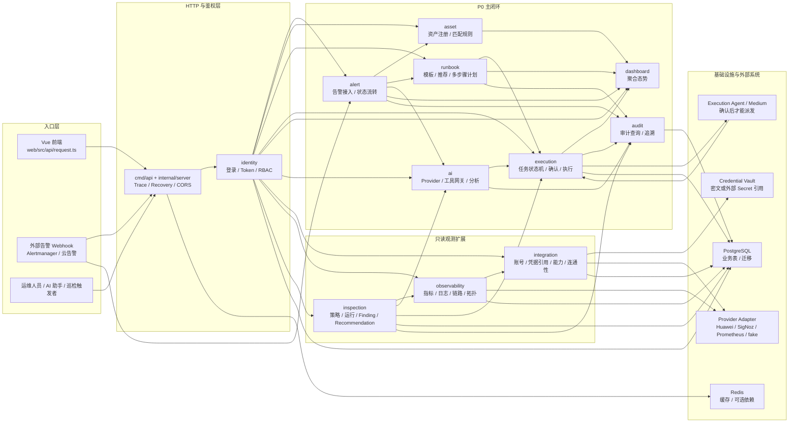
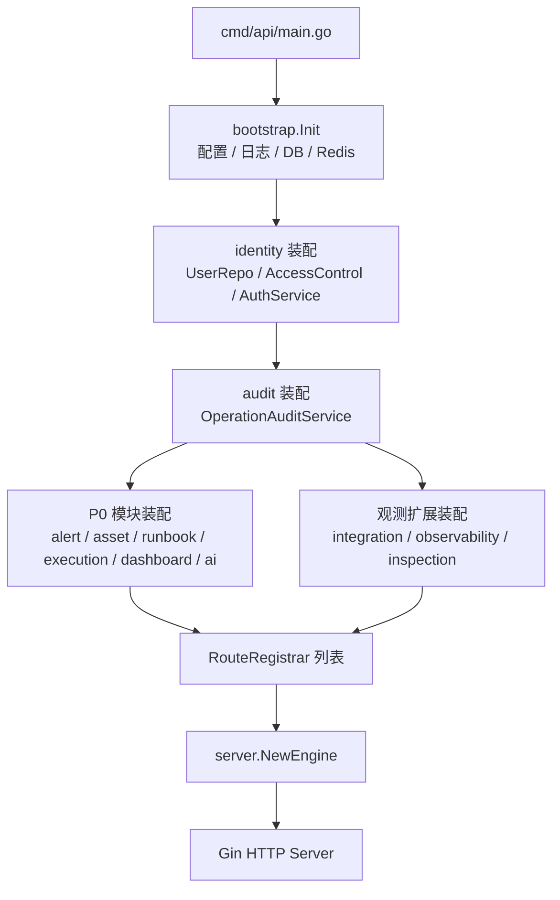

# AI 运维平台整体流程与调用关系

这份文档是全项目的路线总图。读代码、改接口或新增模块前，先用这里的图判断请求会经过哪些限界上下文、在哪里做权限校验、在哪里写审计、哪里只能只读查询，以及哪里才允许触发真实执行。

## 1. 核心原则

- 平台不是让 AI 直接操作生产，而是让 AI 做分析、解释、建议和计划生成。
- 真实变更必须进入 Execution 模块，经过状态机、风险等级、人工确认和审计。
- 外部云、监控、日志、链路系统一律通过 Provider Adapter 接入，domain 与 application 不直接绑定厂商 SDK。
- 凭据只允许在 Integration infrastructure 层加密保存引用，不进入 Prompt、日志、审计明文或前端持久化状态。
- 所有受保护 API 都必须经过 Bearer Token、RBAC、数据范围或工具权限校验；401 与 403 语义必须区分清楚。

## 2. 平台总览图



## 3. 启动装配关系

`cmd/api/main.go` 是当前模块化单体的装配入口。它按“仓储 -> 应用服务 -> HTTP Handler -> RouteRegistrar”的顺序把各上下文接入统一 HTTP 引擎。



## 4. 分层调用规则

每个限界上下文都遵循同一条依赖方向：

```text
interfaces/http -> application -> domain <- infrastructure
```

| 层 | 负责内容 | 禁止事项 |
| --- | --- | --- |
| `interfaces/http` | 绑定 DTO、提取 actor、调用 application、使用 `httpx.OK/Fail` 输出 | 直接操作 GORM、云 SDK、Redis |
| `application` | 编排用例、事务、权限意图、审计 hook、跨上下文 Port | 写 Gin 逻辑，依赖具体厂商 SDK |
| `domain` | 实体、值对象、状态机、领域错误、仓储接口 | import infrastructure，感知 HTTP 或 Gin |
| `infrastructure` | GORM 仓储、Provider Adapter、Credential Vault、审计 recorder | 把明文凭据、原始云错误直接暴露给上层或前端 |

跨上下文调用不要穿透到对方 infrastructure。需要复用能力时，在调用方 application 层定义 Port，再由 infrastructure 提供 adapter。

## 5. 当前主要调用链

### 5.1 告警到执行的 P0 闭环

```text
外部告警
  -> internal/alert/interfaces/http
  -> alert application 标准化、去重、状态流转
  -> asset application / 匹配规则绑定应用和资源
  -> runbook application 按告警上下文推荐模板
  -> execution application 创建待确认任务
  -> 用户确认后 Execution 状态机推进
  -> Dashboard 聚合结果
  -> Audit 记录关键动作
```

这条链路是当前最重要主线。任何 Integration、Observability、Inspection、Execution Agent 改动，都不能破坏这条验收链路。

### 5.2 云账号注册与连通性测试

```text
前端 integrations 页面
  -> /api/integrations/accounts
  -> integration/interfaces/http Handler
  -> AccountService
  -> CredentialVault 加密凭据，只保存引用或密文
  -> integration_* 仓储与 UnitOfWork 原子提交
  -> Provider checker 做只读连通性测试
  -> integration_check_result / integration_capability
  -> audit: integration_account create/update/check
```

关键点：

- API 响应只返回 `has_credential`，不返回 AK/SK/Token。
- 连通性失败的 `message` 必须脱敏。
- `huawei_cloud`、`signoz`、`prometheus` 第一阶段可以由 fake/checker 占位，但真实凭据账号不能返回伪造的云端数据。

### 5.3 统一观测查询

```text
前端 observability 页面 / 巡检服务
  -> /api/observability/metrics/query 或 logs/traces/topology
  -> Observability QueryService
  -> IntegrationAccountPort 解析账号摘要
  -> 校验账号启用状态、provider、capability
  -> ProviderRegistry 按 provider 获取 ProviderEntry
  -> MetricQueryPort / LogSearchPort / TraceQueryPort 等小 Port
  -> obs_evidence_ref 保存证据引用
  -> audit: observability_query
```

关键点：

- Observability 只拿账号摘要和 `credential_ref_id`，不解密凭据。
- 华为 CES/APM/AOM、SigNoz、Prometheus 只属于 adapter，不进入 domain。
- fake provider 要保持确定性和脱敏，方便前端、巡检、CI 先跑通。

### 5.4 巡检到建议

```text
前端 inspections 页面
  -> 创建 InspectionPolicy
  -> 手动触发 Run
  -> RunService 读取 policy.scope/account_id/checks
  -> EvidenceAnalyzer 通过 ObservabilityQueryPort 收集指标/日志/链路证据
  -> 生成 EvidenceSummary
  -> 规则或 AI 分析产出 Finding
  -> 为 Finding 创建 Recommendation
  -> 运行状态 success / partial / failed
  -> audit: inspection_policy / inspection_run / inspection_recommendation
```

关键点：

- 外部数据源部分失败时，应保留已采集证据，允许 `partial`。
- Finding 要带证据引用，Recommendation 要说明原因、风险、是否可转执行。
- AI 分析只消费脱敏证据，不能获取凭据。

### 5.5 建议转执行与执行介体

```text
Recommendation
  -> RecommendationService
  -> ExecutionCreatorPort
  -> execution application 创建 Execution Task
  -> 风险等级和权限校验
  -> medium/high/critical 进入 pending_confirm
  -> 用户输入确认文本后才能 dispatch
  -> Execution Agent / Medium 拉取已确认任务
  -> 日志和结果回传
  -> Execution timeline + Audit
```

关键点：

- Agent 可以提议任务，但不能直接 dispatch 或执行。
- 执行命令必须来自 Command Spec，并绑定参数 schema 校验。
- 执行日志要脱敏，stdout/stderr 摘要不能包含 Token、密码、AK/SK。

## 6. Provider Port 对应关系

| Application Port | 调用者 | 实现位置 | 对应能力 | 备注 |
| --- | --- | --- | --- | --- |
| `IntegrationAccountPort` | Observability | `internal/observability/infrastructure/integration` | 账号摘要 | 只返回 `credential_ref_id`，不解密 |
| `MetricQueryPort` | Observability QueryService | `internal/observability/infrastructure/provider/*` | `metrics` | CES / Prometheus / SigNoz 都经此端口 |
| `LogSearchPort` | Observability QueryService | provider adapter | `logs` | 结果摘要要脱敏 |
| `TraceQueryPort` | Observability QueryService | provider adapter | `traces` | Trace/Span 查询 |
| `TopologyQueryPort` | Observability QueryService | provider adapter | `topology` | `topology` 独立于 `traces` |
| `AssetDiscoveryPort` | Asset Sync / Agent 工具 | provider adapter | `assets` | 资源同步复用 |
| `AlertRuleQueryPort` | Agent 工具 / Observability | provider adapter | `alerts` | 查询告警规则，不修改 |
| `ObservabilityQueryPort` | Inspection | `internal/inspection/infrastructure/observability` | 证据收集 | 包装 QueryService |
| `ExecutionCreatorPort` | Inspection / AI | execution adapter | 执行提议 | 只创建待确认任务 |

## 7. 权限、审计与迁移检查点

| 模块 | 关键权限 | 关键审计资源 | 迁移 |
| --- | --- | --- | --- |
| Integration | `app:integrations:read/create/update/delete/check` | `integration_account` | `0018_init_integration.up.sql` |
| Observability | `app:observability:read` | `observability_query` | `0019_init_observability.up.sql` |
| Inspection | `app:inspections:read/write` | `inspection_policy` / `inspection_run` / `inspection_recommendation` | `0020_init_inspection.up.sql` |
| Execution Agent | `app:execution_agents:*`（继续按契约收敛） | `execution_agent` / `execution_medium` | `0022_init_execution_agent.up.sql` |
| P0 主链路 | alert / asset / runbook / execution / audit 各自权限 | 告警、执行、AI 工具调用 | `0007` 到 `0017` |

新增 API 或状态机时，必须同步更新：

- `ops/*.md` 契约。
- `web/src/api/README.md` 前端调用说明。
- `docs/acceptance-checklist.md` 或对应验收脚本说明。
- migration 权限种子与 admin 角色绑定。

## 8. 维护检查清单

改代码前逐项检查：

1. Handler 是否直接访问 GORM、Redis、云 SDK？如果是，应下沉到 application/infrastructure。
2. application 是否直接 import 具体华为云、SigNoz SDK？如果是，应改为 Port。
3. domain 是否感知 HTTP、Gin、基础设施细节？如果是，应移出 domain。
4. Observability 是否解密凭据？如果是，应移到具体 provider adapter 的受控边界内。
5. AI/Agent 是否绕过 Execution 直接执行？如果是，应改为创建待确认任务。
6. 写操作是否具备权限、审计、trace_id？缺任一项都要补齐。
7. API 是否返回自增 `id` 或明文密钥？如果是，应改为业务 ID 或脱敏字段。

## 9. 文档入口

- 总体演进：`docs/cloud-observability-agent-roadmap.md`
- 稳定契约：`ops/*.md`
- P0 流程图：`docs/AI运维平台核心业务流程图.md`
- 技术架构：`docs/AI运维平台技术架构设计.md`
- 前端 API：`web/src/api/README.md`
