# AI 运维平台核心业务流程图

## 1. 文档概述

### 1.1 文档目的

本文档基于《AI 运维平台项目工程需求文档》《AI 运维平台信息架构》和《AI 运维平台页面原型》，梳理 AI 运维平台的核心业务流程，并以流程图形式描述关键业务链路。

本文档用于指导产品评审、技术架构设计、前后端接口拆分、权限与审计设计、自动化执行设计和后续研发排期。

### 1.2 流程设计原则

- 所有高风险动作必须先确认，后执行。
- AI 负责分析、建议和生成计划，不直接绕过平台执行真实操作。
- 用户权限、资源范围、风险等级必须在执行前校验。
- 告警、资源、日志、指标、变更、工单、知识库之间需要形成上下文闭环。
- 所有关键行为必须写入审计日志。
- 执行失败必须给出失败原因，并支持重试、回滚或人工接管。

### 1.3 图示说明

本文档中的流程图采用 Mermaid 语法，可在支持 Mermaid 的 Markdown 工具中直接渲染。

## 2. 平台总体业务闭环

### 2.1 流程说明

AI 运维平台的总体闭环是：用户或系统发现问题，平台聚合上下文，AI 辅助分析，用户确认方案，平台执行动作，记录结果并沉淀知识。

### 2.2 流程图

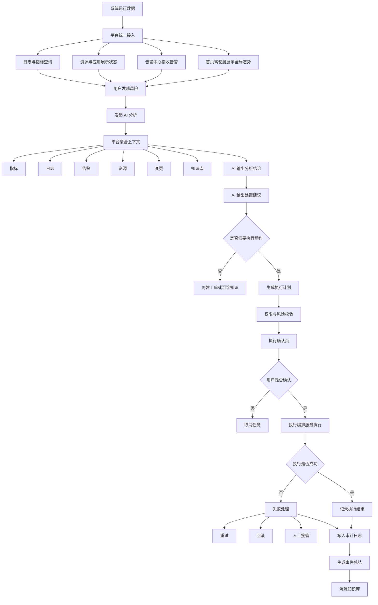
```mermaid
flowchart TD
    A[系统运行数据] --> B[平台统一接入]
    B --> C[首页驾驶舱展示全局态势]
    B --> D[告警中心接收告警]
    B --> E[资源与应用展示状态]
    B --> F[日志与指标查询]

    C --> G[用户发现风险]
    D --> G
    E --> G
    F --> G

    G --> H[发起 AI 分析]
    H --> I[平台聚合上下文]
    I --> I1[指标]
    I --> I2[日志]
    I --> I3[告警]
    I --> I4[资源]
    I --> I5[变更]
    I --> I6[知识库]

    I --> J[AI 输出分析结论]
    J --> K[AI 给出处置建议]
    K --> L{是否需要执行动作}

    L -- 否 --> M[创建工单或沉淀知识]
    L -- 是 --> N[生成执行计划]
    N --> O[权限与风险校验]
    O --> P[执行确认页]
    P --> Q{用户是否确认}

    Q -- 否 --> R[取消任务]
    Q -- 是 --> S[执行编排服务执行]
    S --> T{执行是否成功}

    T -- 是 --> U[记录执行结果]
    T -- 否 --> V[失败处理]
    V --> V1[重试]
    V --> V2[回滚]
    V --> V3[人工接管]

    U --> W[写入审计日志]
    V --> W
    W --> X[生成事件总结]
    X --> Y[沉淀知识库]
```

## 3. AI 辅助故障处理流程

### 3.1 流程说明

该流程用于处理监控告警、用户主动排查或系统异常趋势发现后的故障分析与处置。

### 3.2 流程图

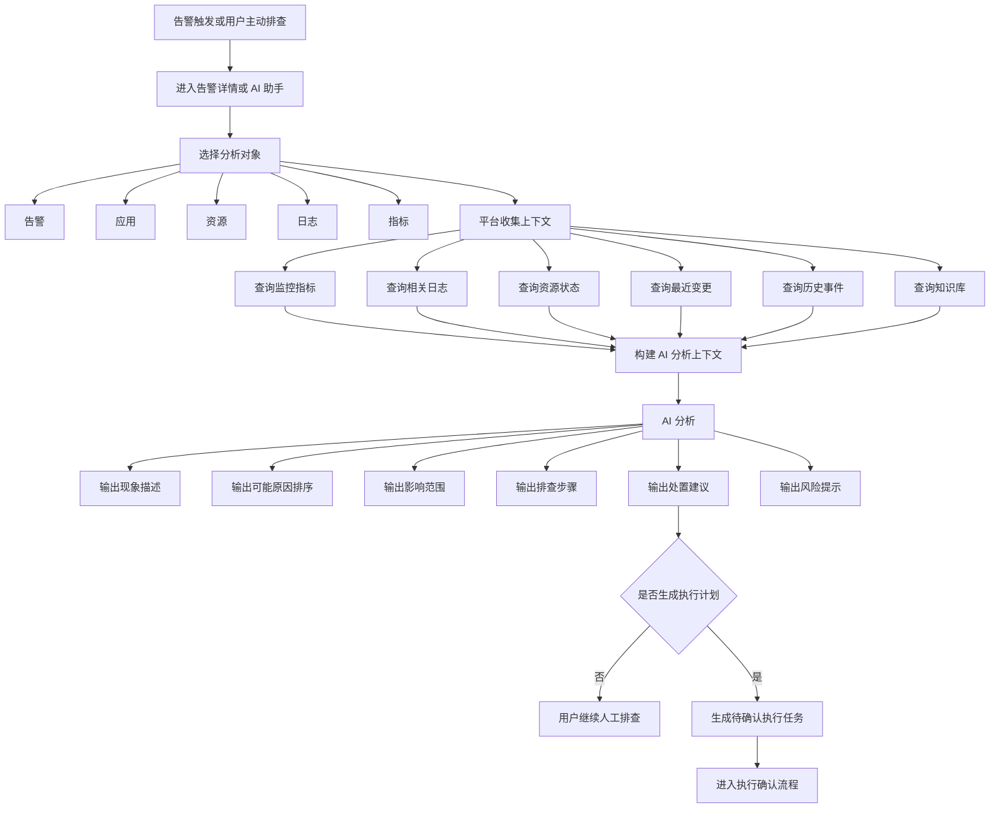
```mermaid
flowchart TD
    A[告警触发或用户主动排查] --> B[进入告警详情或 AI 助手]
    B --> C[选择分析对象]
    C --> C1[告警]
    C --> C2[应用]
    C --> C3[资源]
    C --> C4[日志]
    C --> C5[指标]

    C --> D[平台收集上下文]
    D --> E[查询监控指标]
    D --> F[查询相关日志]
    D --> G[查询资源状态]
    D --> H[查询最近变更]
    D --> I[查询历史事件]
    D --> J[查询知识库]

    E --> K[构建 AI 分析上下文]
    F --> K
    G --> K
    H --> K
    I --> K
    J --> K

    K --> L[AI 分析]
    L --> M[输出现象描述]
    L --> N[输出可能原因排序]
    L --> O[输出影响范围]
    L --> P[输出排查步骤]
    L --> Q[输出处置建议]
    L --> R[输出风险提示]

    Q --> S{是否生成执行计划}
    S -- 否 --> T[用户继续人工排查]
    S -- 是 --> U[生成待确认执行任务]
    U --> V[进入执行确认流程]
```

## 4. 告警处理流程

### 4.1 流程说明

告警处理流程覆盖告警接入、聚合、认领、AI 分析、处理、关闭和复盘。

### 4.2 流程图

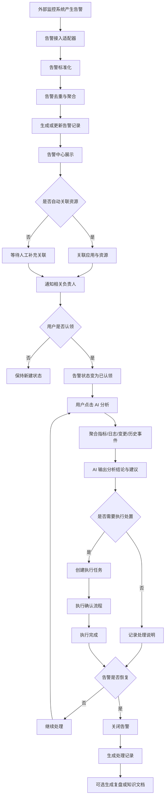
```mermaid
flowchart TD
    A[外部监控系统产生告警] --> B[告警接入适配器]
    B --> C[告警标准化]
    C --> D[告警去重与聚合]
    D --> E[生成或更新告警记录]
    E --> F[告警中心展示]

    F --> G{是否自动关联资源}
    G -- 是 --> H[关联应用与资源]
    G -- 否 --> I[等待人工补充关联]

    H --> J[通知相关负责人]
    I --> J
    J --> K{用户是否认领}
    K -- 否 --> L[保持新建状态]
    K -- 是 --> M[告警状态变为已认领]

    M --> N[用户点击 AI 分析]
    N --> O[聚合指标/日志/变更/历史事件]
    O --> P[AI 输出分析结论与建议]
    P --> Q{是否需要执行处置}

    Q -- 否 --> R[记录处理说明]
    Q -- 是 --> S[创建执行任务]
    S --> T[执行确认流程]
    T --> U[执行完成]

    R --> V{告警是否恢复}
    U --> V
    V -- 否 --> W[继续处理]
    W --> N
    V -- 是 --> X[关闭告警]
    X --> Y[生成处理记录]
    Y --> Z[可选生成复盘或知识文档]
```

## 5. AI 生成执行计划流程

### 5.1 流程说明

AI 可以根据用户问题、告警上下文或资源状态生成执行计划，但不能直接执行。执行计划必须进入平台任务系统并进行权限、风险和人工确认。

### 5.2 流程图

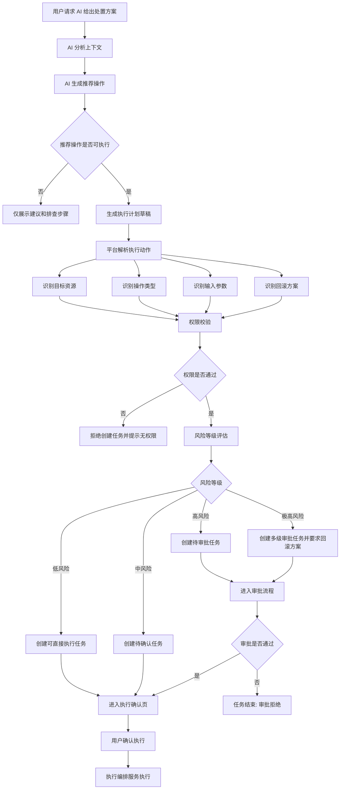
```mermaid
flowchart TD
    A[用户请求 AI 给出处置方案] --> B[AI 分析上下文]
    B --> C[AI 生成推荐操作]
    C --> D{推荐操作是否可执行}

    D -- 否 --> E[仅展示建议和排查步骤]
    D -- 是 --> F[生成执行计划草稿]

    F --> G[平台解析执行动作]
    G --> H[识别目标资源]
    G --> I[识别操作类型]
    G --> J[识别输入参数]
    G --> K[识别回滚方案]

    H --> L[权限校验]
    I --> L
    J --> L
    K --> L

    L --> M{权限是否通过}
    M -- 否 --> N[拒绝创建任务并提示无权限]
    M -- 是 --> O[风险等级评估]

    O --> P{风险等级}
    P -- 低风险 --> Q[创建可直接执行任务]
    P -- 中风险 --> R[创建待确认任务]
    P -- 高风险 --> S[创建待审批任务]
    P -- 极高风险 --> T[创建多级审批任务并要求回滚方案]

    Q --> U[进入执行确认页]
    R --> U
    S --> V[进入审批流程]
    T --> V

    V --> W{审批是否通过}
    W -- 否 --> X[任务结束: 审批拒绝]
    W -- 是 --> U

    U --> Y[用户确认执行]
    Y --> Z[执行编排服务执行]
```

## 6. 执行确认流程

### 6.1 流程说明

执行确认流程是平台安全设计的核心，所有中高风险运维操作都必须经过该流程。

### 6.2 流程图

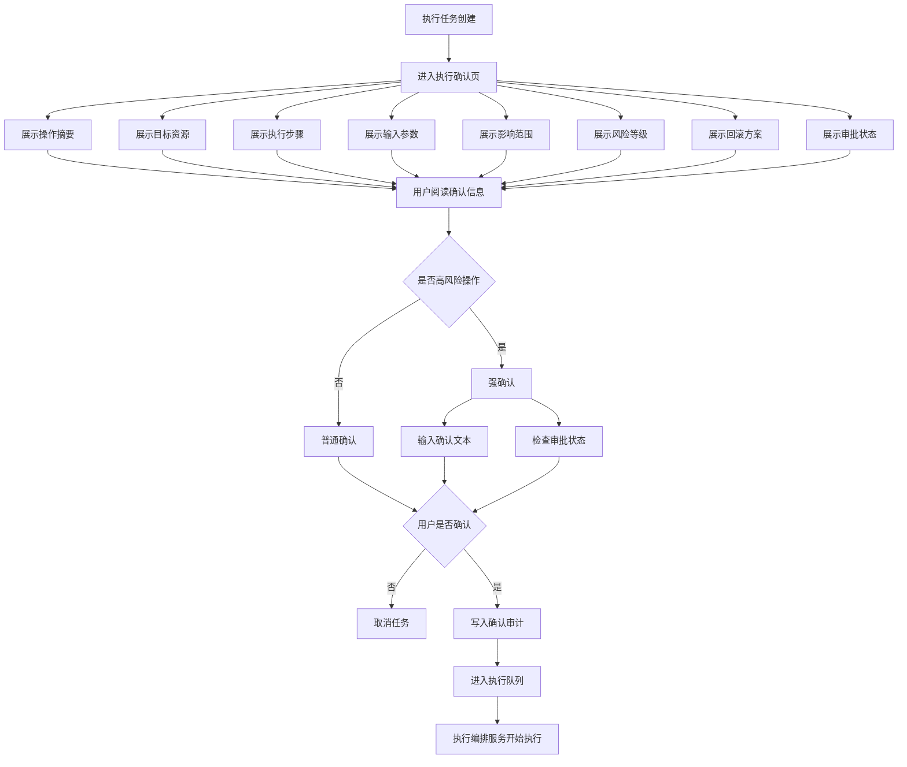
```mermaid
flowchart TD
    A[执行任务创建] --> B[进入执行确认页]
    B --> C[展示操作摘要]
    B --> D[展示目标资源]
    B --> E[展示执行步骤]
    B --> F[展示输入参数]
    B --> G[展示影响范围]
    B --> H[展示风险等级]
    B --> I[展示回滚方案]
    B --> J[展示审批状态]

    C --> K[用户阅读确认信息]
    D --> K
    E --> K
    F --> K
    G --> K
    H --> K
    I --> K
    J --> K

    K --> L{是否高风险操作}
    L -- 否 --> M[普通确认]
    L -- 是 --> N[强确认]
    N --> N1[输入确认文本]
    N --> N2[检查审批状态]

    M --> O{用户是否确认}
    N1 --> O
    N2 --> O

    O -- 否 --> P[取消任务]
    O -- 是 --> Q[写入确认审计]
    Q --> R[进入执行队列]
    R --> S[执行编排服务开始执行]
```

## 7. 自动化执行流程

### 7.1 流程说明

自动化执行流程负责执行脚本、API 操作、Kubernetes 操作、云平台操作或任务编排。

### 7.2 流程图

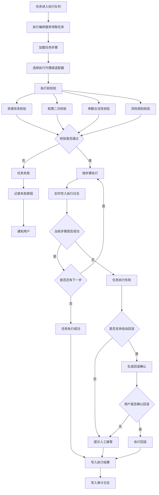
```mermaid
flowchart TD
    A[任务进入执行队列] --> B[执行编排服务领取任务]
    B --> C[加载任务步骤]
    C --> D[选择执行代理或适配器]
    D --> E[执行前校验]
    E --> E1[资源状态校验]
    E --> E2[权限二次校验]
    E --> E3[参数合法性校验]
    E --> E4[风险规则校验]

    E1 --> F{校验是否通过}
    E2 --> F
    E3 --> F
    E4 --> F

    F -- 否 --> G[任务失败]
    G --> H[记录失败原因]
    H --> I[通知用户]

    F -- 是 --> J[按步骤执行]
    J --> K[实时写入执行日志]
    K --> L{当前步骤是否成功}

    L -- 是 --> M{是否还有下一步}
    M -- 是 --> J
    M -- 否 --> N[任务执行成功]

    L -- 否 --> O[任务执行失败]
    O --> P{是否支持自动回滚}
    P -- 否 --> Q[提示人工接管]
    P -- 是 --> R[生成回滚确认]
    R --> S{用户是否确认回滚}
    S -- 否 --> Q
    S -- 是 --> T[执行回滚]

    N --> U[写入执行结果]
    T --> U
    Q --> U
    U --> V[写入审计日志]
```

### 7.3 指定执行介体流程（P1+）

该流程用于 AI 分析后给出建议，运维人员确认后，通过指定介体执行诊断命令或处置步骤。

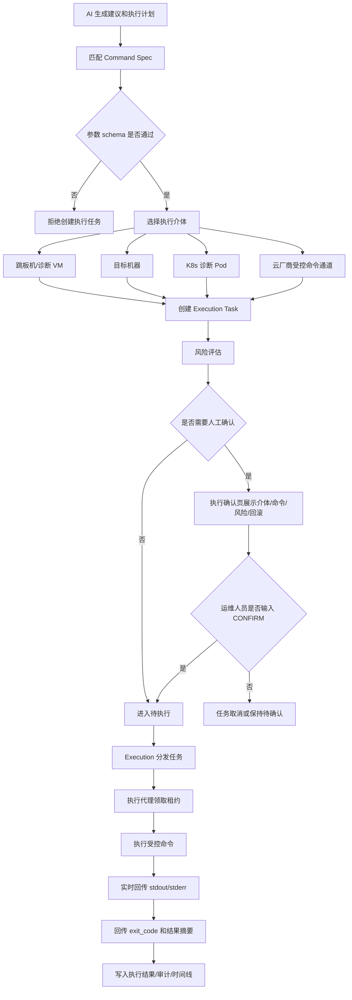
```mermaid
flowchart TD
    A[AI 生成建议和执行计划] --> B[匹配 Command Spec]
    B --> C{参数 schema 是否通过}
    C -- 否 --> D[拒绝创建执行任务]
    C -- 是 --> E[选择执行介体]

    E --> E1[跳板机/诊断 VM]
    E --> E2[目标机器]
    E --> E3[K8s 诊断 Pod]
    E --> E4[云厂商受控命令通道]

    E1 --> F[创建 Execution Task]
    E2 --> F
    E3 --> F
    E4 --> F

    F --> G[风险评估]
    G --> H{是否需要人工确认}
    H -- 是 --> I[执行确认页展示介体/命令/风险/回滚]
    H -- 否 --> J[进入待执行]
    I --> K{运维人员是否输入 CONFIRM}
    K -- 否 --> L[任务取消或保持待确认]
    K -- 是 --> J

    J --> M[Execution 分发任务]
    M --> N[执行代理领取租约]
    N --> O[执行受控命令]
    O --> P[实时回传 stdout/stderr]
    P --> Q[回传 exit_code 和结果摘要]
    Q --> R[写入执行结果/审计/时间线]
```

关键约束：

- AI 只能生成计划和参数，不能直接执行命令。
- 运维人员必须能看到并确认执行介体、命令规格、参数、风险和影响范围。
- 执行代理只能领取 `pending_execute` 任务。
- 禁止未匹配 Command Spec 的自由命令直接执行。
- 日志回传必须脱敏，服务端必须二次脱敏。

## 8. 变更与发布流程

### 8.1 流程说明

变更与发布流程用于管理应用发布、配置变更、基础设施变更，并通过 AI 进行风险分析。

### 8.2 流程图

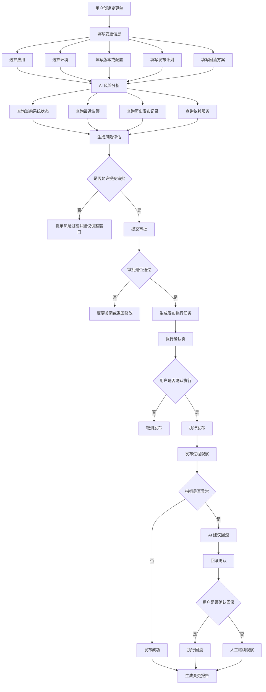
```mermaid
flowchart TD
    A[用户创建变更单] --> B[填写变更信息]
    B --> B1[选择应用]
    B --> B2[选择环境]
    B --> B3[填写版本或配置]
    B --> B4[填写发布计划]
    B --> B5[填写回滚方案]

    B1 --> C[AI 风险分析]
    B2 --> C
    B3 --> C
    B4 --> C
    B5 --> C

    C --> D[查询当前系统状态]
    C --> E[查询最近告警]
    C --> F[查询历史发布记录]
    C --> G[查询依赖服务]

    D --> H[生成风险评估]
    E --> H
    F --> H
    G --> H

    H --> I{是否允许提交审批}
    I -- 否 --> J[提示风险过高并建议调整窗口]
    I -- 是 --> K[提交审批]

    K --> L{审批是否通过}
    L -- 否 --> M[变更关闭或退回修改]
    L -- 是 --> N[生成发布执行任务]

    N --> O[执行确认页]
    O --> P{用户是否确认执行}
    P -- 否 --> Q[取消发布]
    P -- 是 --> R[执行发布]

    R --> S[发布过程观察]
    S --> T{指标是否异常}
    T -- 否 --> U[发布成功]
    T -- 是 --> V[AI 建议回滚]
    V --> W[回滚确认]
    W --> X{用户是否确认回滚}
    X -- 否 --> Y[人工继续观察]
    X -- 是 --> Z[执行回滚]

    U --> AA[生成变更报告]
    Z --> AA
    Y --> AA
```

## 9. 资源异常排查流程

### 9.1 流程说明

用户从资源或应用视角进入问题排查，通过指标、日志、告警和 AI 分析完成定位。

### 9.2 流程图

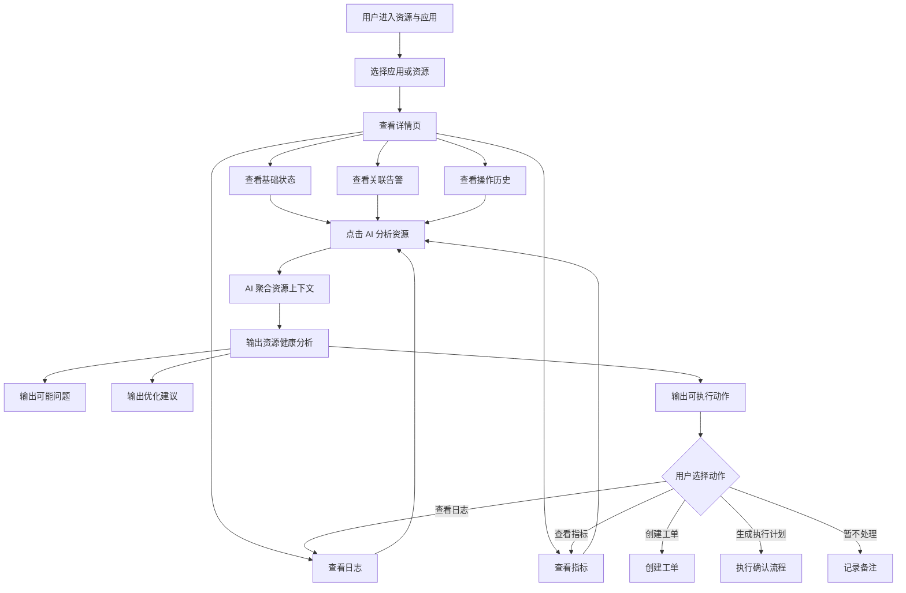
```mermaid
flowchart TD
    A[用户进入资源与应用] --> B[选择应用或资源]
    B --> C[查看详情页]
    C --> D[查看基础状态]
    C --> E[查看指标]
    C --> F[查看日志]
    C --> G[查看关联告警]
    C --> H[查看操作历史]

    D --> I[点击 AI 分析资源]
    E --> I
    F --> I
    G --> I
    H --> I

    I --> J[AI 聚合资源上下文]
    J --> K[输出资源健康分析]
    K --> L[输出可能问题]
    K --> M[输出优化建议]
    K --> N[输出可执行动作]

    N --> O{用户选择动作}
    O -- 查看日志 --> F
    O -- 查看指标 --> E
    O -- 创建工单 --> P[创建工单]
    O -- 生成执行计划 --> Q[执行确认流程]
    O -- 暂不处理 --> R[记录备注]
```

## 10. 日志与指标分析流程

### 10.1 流程说明

日志与指标分析流程用于故障排查中的数据分析，AI 可总结异常模式和趋势原因。

### 10.2 流程图

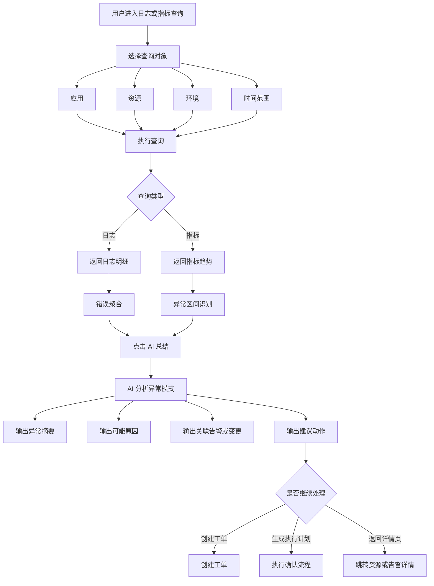
```mermaid
flowchart TD
    A[用户进入日志或指标查询] --> B[选择查询对象]
    B --> B1[应用]
    B --> B2[资源]
    B --> B3[环境]
    B --> B4[时间范围]

    B1 --> C[执行查询]
    B2 --> C
    B3 --> C
    B4 --> C

    C --> D{查询类型}
    D -- 日志 --> E[返回日志明细]
    D -- 指标 --> F[返回指标趋势]

    E --> G[错误聚合]
    F --> H[异常区间识别]

    G --> I[点击 AI 总结]
    H --> I

    I --> J[AI 分析异常模式]
    J --> K[输出异常摘要]
    J --> L[输出可能原因]
    J --> M[输出关联告警或变更]
    J --> N[输出建议动作]

    N --> O{是否继续处理}
    O -- 创建工单 --> P[创建工单]
    O -- 生成执行计划 --> Q[执行确认流程]
    O -- 返回详情页 --> R[跳转资源或告警详情]
```

## 11. 工单协同流程

### 11.1 流程说明

工单用于问题跟进、人工协同、研发介入和处理记录沉淀。

### 11.2 流程图

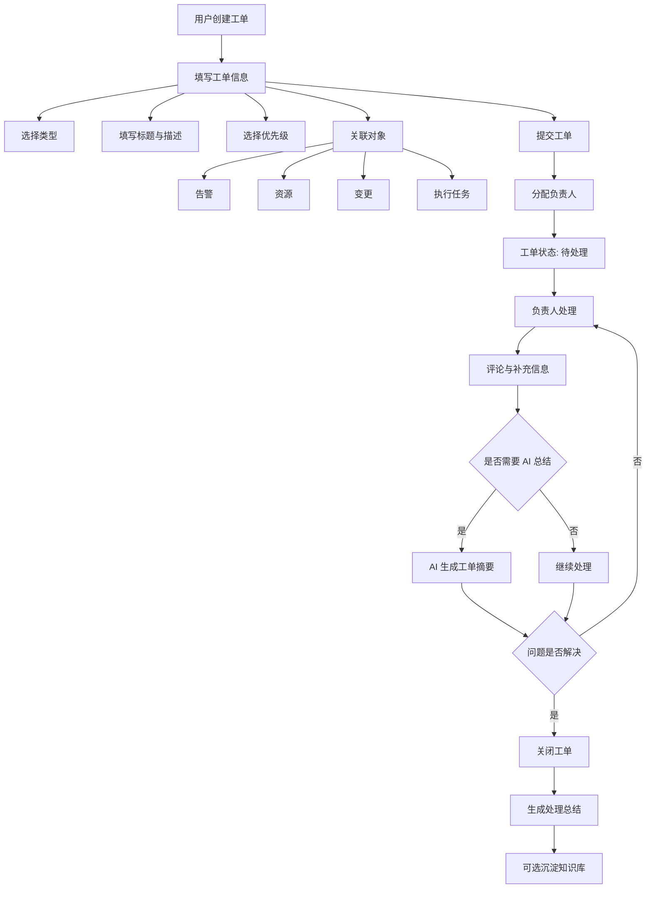
```mermaid
flowchart TD
    A[用户创建工单] --> B[填写工单信息]
    B --> B1[选择类型]
    B --> B2[填写标题与描述]
    B --> B3[选择优先级]
    B --> B4[关联对象]
    B4 --> B41[告警]
    B4 --> B42[资源]
    B4 --> B43[变更]
    B4 --> B44[执行任务]

    B --> C[提交工单]
    C --> D[分配负责人]
    D --> E[工单状态: 待处理]
    E --> F[负责人处理]
    F --> G[评论与补充信息]
    G --> H{是否需要 AI 总结}
    H -- 是 --> I[AI 生成工单摘要]
    H -- 否 --> J[继续处理]

    I --> K{问题是否解决}
    J --> K
    K -- 否 --> F
    K -- 是 --> L[关闭工单]
    L --> M[生成处理总结]
    M --> N[可选沉淀知识库]
```

## 12. 知识库沉淀流程

### 12.1 流程说明

知识库用于沉淀故障处理经验、SOP、复盘报告和常见问题，并为 AI 提供知识增强。

### 12.2 流程图

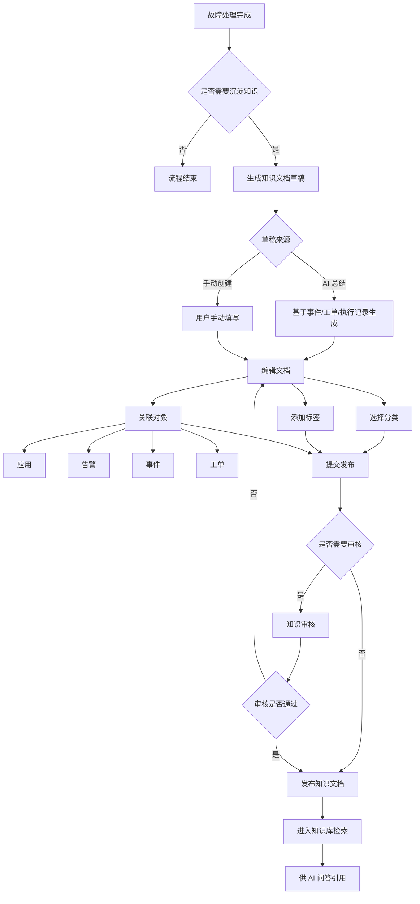
```mermaid
flowchart TD
    A[故障处理完成] --> B{是否需要沉淀知识}
    B -- 否 --> C[流程结束]
    B -- 是 --> D[生成知识文档草稿]

    D --> E{草稿来源}
    E -- AI 总结 --> F[基于事件/工单/执行记录生成]
    E -- 手动创建 --> G[用户手动填写]

    F --> H[编辑文档]
    G --> H
    H --> I[选择分类]
    H --> J[添加标签]
    H --> K[关联对象]
    K --> K1[应用]
    K --> K2[告警]
    K --> K3[事件]
    K --> K4[工单]

    I --> L[提交发布]
    J --> L
    K --> L

    L --> M{是否需要审核}
    M -- 否 --> N[发布知识文档]
    M -- 是 --> O[知识审核]
    O --> P{审核是否通过}
    P -- 否 --> H
    P -- 是 --> N

    N --> Q[进入知识库检索]
    Q --> R[供 AI 问答引用]
```

## 13. 权限校验流程

### 13.1 流程说明

平台所有敏感访问和操作都必须经过权限校验，AI 工具调用也必须继承当前用户身份权限。

### 13.2 流程图

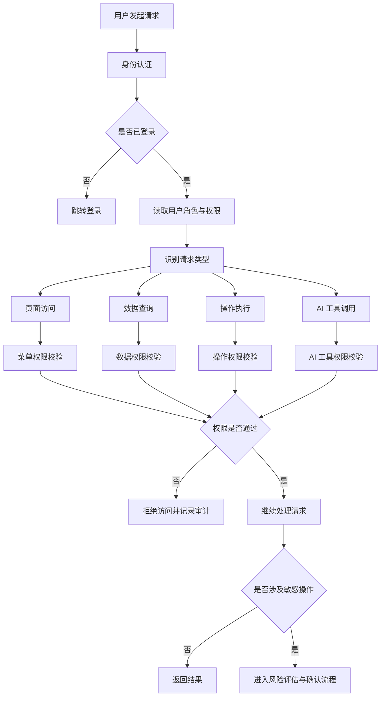
```mermaid
flowchart TD
    A[用户发起请求] --> B[身份认证]
    B --> C{是否已登录}
    C -- 否 --> D[跳转登录]
    C -- 是 --> E[读取用户角色与权限]

    E --> F[识别请求类型]
    F --> F1[页面访问]
    F --> F2[数据查询]
    F --> F3[操作执行]
    F --> F4[AI 工具调用]

    F1 --> G[菜单权限校验]
    F2 --> H[数据权限校验]
    F3 --> I[操作权限校验]
    F4 --> J[AI 工具权限校验]

    G --> K{权限是否通过}
    H --> K
    I --> K
    J --> K

    K -- 否 --> L[拒绝访问并记录审计]
    K -- 是 --> M[继续处理请求]

    M --> N{是否涉及敏感操作}
    N -- 否 --> O[返回结果]
    N -- 是 --> P[进入风险评估与确认流程]
```

## 14. 审批流程

### 14.1 流程说明

中高风险任务或变更需要审批。第一阶段可先支持单级审批，后续扩展多级审批。

### 14.2 流程图

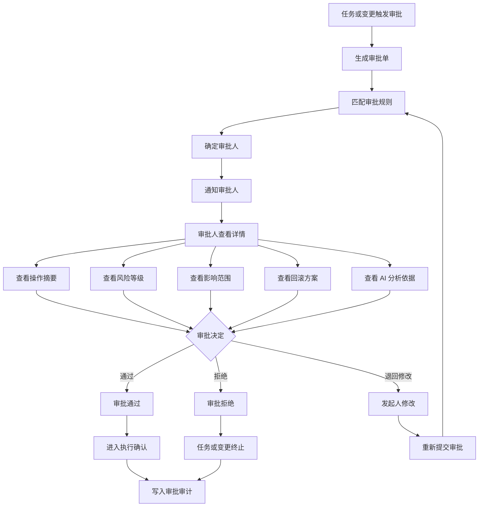
```mermaid
flowchart TD
    A[任务或变更触发审批] --> B[生成审批单]
    B --> C[匹配审批规则]
    C --> D[确定审批人]
    D --> E[通知审批人]
    E --> F[审批人查看详情]

    F --> G[查看操作摘要]
    F --> H[查看风险等级]
    F --> I[查看影响范围]
    F --> J[查看回滚方案]
    F --> K[查看 AI 分析依据]

    G --> L{审批决定}
    H --> L
    I --> L
    J --> L
    K --> L

    L -- 通过 --> M[审批通过]
    L -- 拒绝 --> N[审批拒绝]
    L -- 退回修改 --> O[发起人修改]

    M --> P[进入执行确认]
    N --> Q[任务或变更终止]
    O --> R[重新提交审批]
    R --> C

    P --> S[写入审批审计]
    Q --> S
```

## 15. 审计记录流程

### 15.1 流程说明

审计流程贯穿平台所有关键操作，尤其是 AI 工具调用、执行确认、审批、脚本执行和权限变更。

### 15.2 流程图

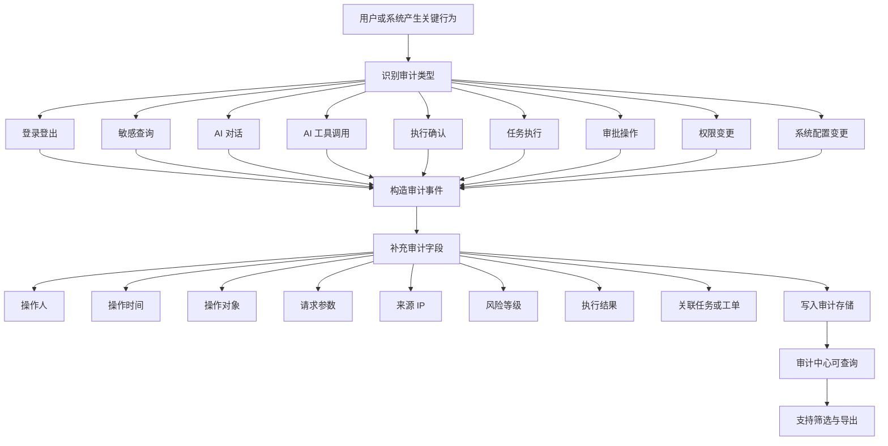
```mermaid
flowchart TD
    A[用户或系统产生关键行为] --> B[识别审计类型]
    B --> B1[登录登出]
    B --> B2[敏感查询]
    B --> B3[AI 对话]
    B --> B4[AI 工具调用]
    B --> B5[执行确认]
    B --> B6[任务执行]
    B --> B7[审批操作]
    B --> B8[权限变更]
    B --> B9[系统配置变更]

    B1 --> C[构造审计事件]
    B2 --> C
    B3 --> C
    B4 --> C
    B5 --> C
    B6 --> C
    B7 --> C
    B8 --> C
    B9 --> C

    C --> D[补充审计字段]
    D --> D1[操作人]
    D --> D2[操作时间]
    D --> D3[操作对象]
    D --> D4[请求参数]
    D --> D5[来源 IP]
    D --> D6[风险等级]
    D --> D7[执行结果]
    D --> D8[关联任务或工单]

    D --> E[写入审计存储]
    E --> F[审计中心可查询]
    F --> G[支持筛选与导出]
```

## 16. AI 工具调用流程

### 16.1 流程说明

AI 工具调用必须经过平台统一编排和权限控制，不能绕过业务服务直接访问敏感系统。

### 16.2 流程图

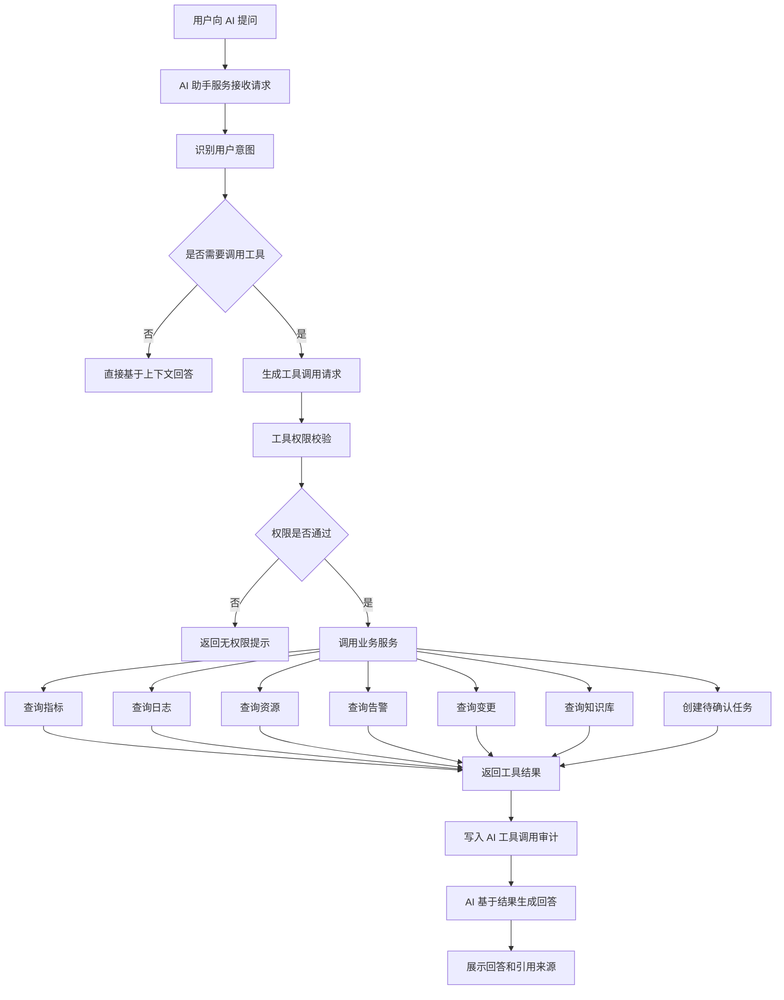
```mermaid
flowchart TD
    A[用户向 AI 提问] --> B[AI 助手服务接收请求]
    B --> C[识别用户意图]
    C --> D{是否需要调用工具}

    D -- 否 --> E[直接基于上下文回答]
    D -- 是 --> F[生成工具调用请求]

    F --> G[工具权限校验]
    G --> H{权限是否通过}
    H -- 否 --> I[返回无权限提示]
    H -- 是 --> J[调用业务服务]

    J --> J1[查询指标]
    J --> J2[查询日志]
    J --> J3[查询资源]
    J --> J4[查询告警]
    J --> J5[查询变更]
    J --> J6[查询知识库]
    J --> J7[创建待确认任务]

    J1 --> K[返回工具结果]
    J2 --> K
    J3 --> K
    J4 --> K
    J5 --> K
    J6 --> K
    J7 --> K

    K --> L[写入 AI 工具调用审计]
    L --> M[AI 基于结果生成回答]
    M --> N[展示回答和引用来源]
```

## 17. 第一阶段核心闭环流程

### 17.1 流程说明

第一阶段最核心的验证路径是从告警发现到 AI 分析，再到执行确认和审计闭环。

### 17.2 流程图

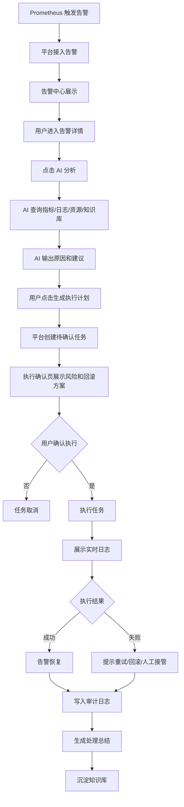
```mermaid
flowchart TD
    A[Prometheus 触发告警] --> B[平台接入告警]
    B --> C[告警中心展示]
    C --> D[用户进入告警详情]
    D --> E[点击 AI 分析]
    E --> F[AI 查询指标/日志/资源/知识库]
    F --> G[AI 输出原因和建议]
    G --> H[用户点击生成执行计划]
    H --> I[平台创建待确认任务]
    I --> J[执行确认页展示风险和回滚方案]
    J --> K{用户确认执行}
    K -- 否 --> L[任务取消]
    K -- 是 --> M[执行任务]
    M --> N[展示实时日志]
    N --> O{执行结果}
    O -- 成功 --> P[告警恢复]
    O -- 失败 --> Q[提示重试/回滚/人工接管]
    P --> R[写入审计日志]
    Q --> R
    R --> S[生成处理总结]
    S --> T[沉淀知识库]
```

## 18. 异常与失败处理流程

### 18.1 流程说明

平台需要对 AI 失败、工具调用失败、执行失败、审批拒绝、权限不足等异常场景有明确处理方式。

### 18.2 流程图

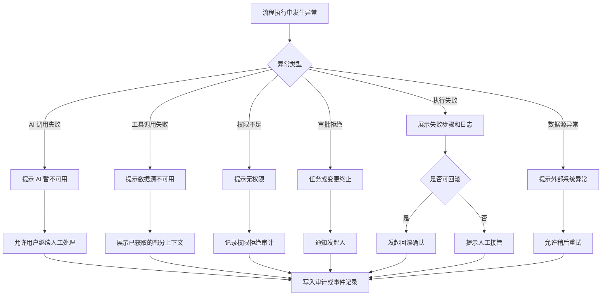
```mermaid
flowchart TD
    A[流程执行中发生异常] --> B{异常类型}

    B -- AI 调用失败 --> C[提示 AI 暂不可用]
    C --> C1[允许用户继续人工处理]

    B -- 工具调用失败 --> D[提示数据源不可用]
    D --> D1[展示已获取的部分上下文]

    B -- 权限不足 --> E[提示无权限]
    E --> E1[记录权限拒绝审计]

    B -- 审批拒绝 --> F[任务或变更终止]
    F --> F1[通知发起人]

    B -- 执行失败 --> G[展示失败步骤和日志]
    G --> H{是否可回滚}
    H -- 是 --> I[发起回滚确认]
    H -- 否 --> J[提示人工接管]

    B -- 数据源异常 --> K[提示外部系统异常]
    K --> K1[允许稍后重试]

    C1 --> L[写入审计或事件记录]
    D1 --> L
    E1 --> L
    F1 --> L
    I --> L
    J --> L
    K1 --> L
```

## 19. 端到端页面流转关系

### 19.1 页面流转图

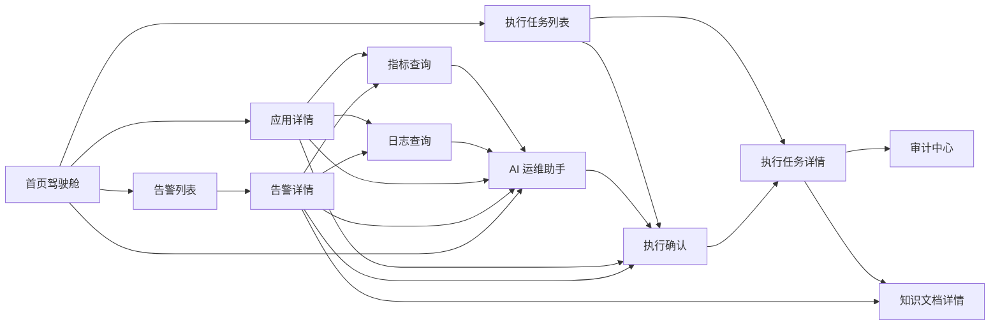
```mermaid
flowchart LR
    A[首页驾驶舱] --> B[告警列表]
    A --> C[应用详情]
    A --> D[AI 运维助手]
    A --> E[执行任务列表]

    B --> F[告警详情]
    F --> D
    F --> G[日志查询]
    F --> H[指标查询]
    F --> I[执行确认]
    F --> J[知识文档详情]

    C --> G
    C --> H
    C --> I
    C --> D

    D --> I
    I --> K[执行任务详情]
    K --> L[审计中心]
    K --> J

    G --> D
    H --> D
    E --> I
    E --> K
```

## 20. 云厂商只读接管与观测智能体巡检流程（P1+）

### 20.1 流程说明

该流程描述平台从华为云、其他云厂商、Signoz 等系统获取只读观测数据，并由观测智能体持续巡检、生成证据化建议的后续演进链路。该流程不替代 P0 告警闭环，而是在资源、指标、日志、链路和告警上下文更完整后，增强 AI 分析质量。

安全边界保持不变：Agent 只读观察和建议，真实变更必须进入 Execution。

### 20.2 流程图

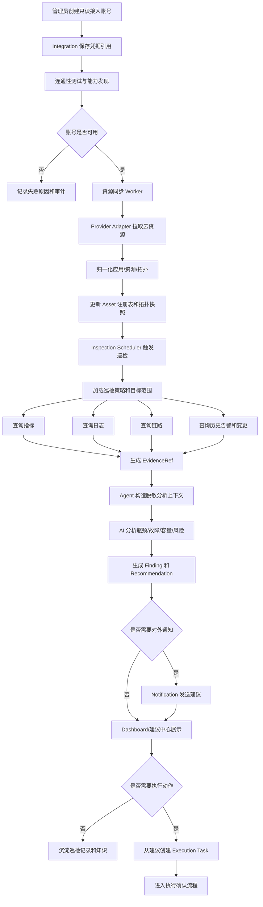
```mermaid
flowchart TD
    A[管理员创建只读接入账号] --> B[Integration 保存凭据引用]
    B --> C[连通性测试与能力发现]
    C --> D{账号是否可用}
    D -- 否 --> E[记录失败原因和审计]
    D -- 是 --> F[资源同步 Worker]

    F --> G[Provider Adapter 拉取云资源]
    G --> H[归一化应用/资源/拓扑]
    H --> I[更新 Asset 注册表和拓扑快照]

    I --> J[Inspection Scheduler 触发巡检]
    J --> K[加载巡检策略和目标范围]
    K --> L[查询指标]
    K --> M[查询日志]
    K --> N[查询链路]
    K --> O[查询历史告警和变更]

    L --> P[生成 EvidenceRef]
    M --> P
    N --> P
    O --> P

    P --> Q[Agent 构造脱敏分析上下文]
    Q --> R[AI 分析瓶颈/故障/容量/风险]
    R --> S[生成 Finding 和 Recommendation]
    S --> T{是否需要对外通知}
    T -- 是 --> U[Notification 发送建议]
    T -- 否 --> V[Dashboard/建议中心展示]
    U --> V

    V --> W{是否需要执行动作}
    W -- 否 --> X[沉淀巡检记录和知识]
    W -- 是 --> Y[从建议创建 Execution Task]
    Y --> Z[进入执行确认流程]
```

### 20.3 关键约束

- Integration 凭据不进入 AI Prompt、日志、审计明文和前端持久化状态。
- Provider Adapter 只实现只读查询；写操作必须走 Execution。
- Observability 查询必须产生证据引用，便于审计和复盘。
- Inspection 运行允许 `partial`，外部数据源部分失败时不能影响已采集证据。
- Recommendation 转 Execution 时，中高风险动作必须进入 `pending_confirm`。

详细设计见 `docs/cloud-observability-agent-roadmap.md` 和 `ops/cloud-observability-contract.md`。

## 21. 流程总结

AI 运维平台的核心业务流程以“问题发现、上下文聚合、AI 分析、人工确认、安全执行、审计追溯、知识沉淀”为主线。

其中，第一阶段应优先实现以下四条关键闭环：

1. 告警接入与告警详情闭环。
2. AI 分析与执行计划生成闭环。
3. 执行确认与自动化执行闭环。
4. 执行结果、审计记录与知识沉淀闭环。

平台必须始终坚持：AI 可以分析和建议，但不能绕过权限、风险评估和人工确认直接执行高风险动作。
