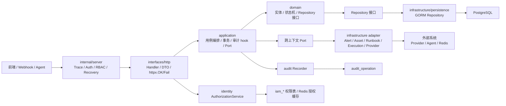
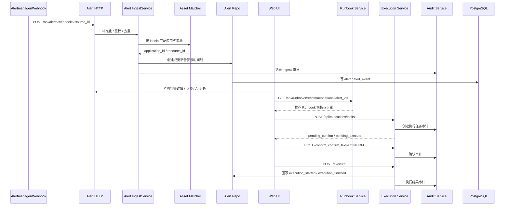
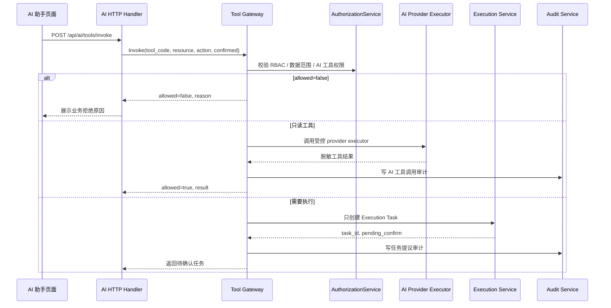
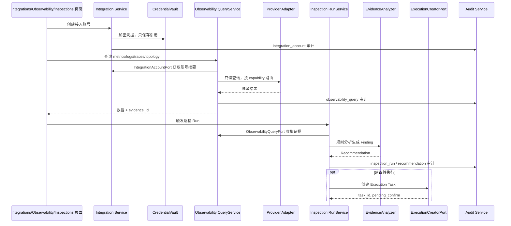
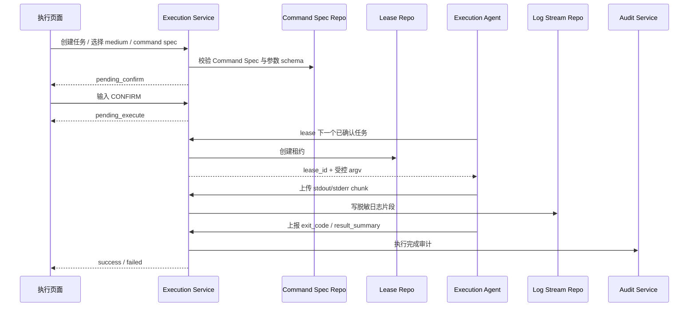
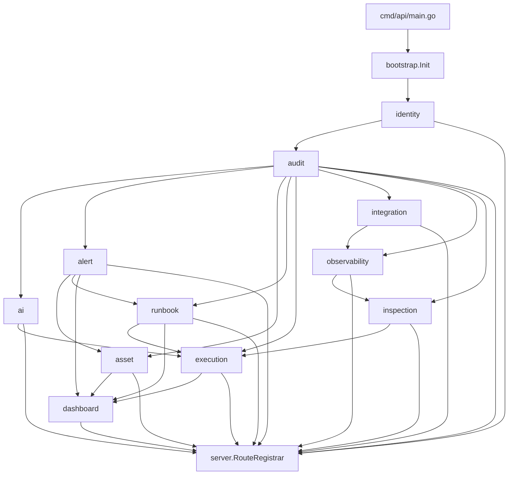

# AI 运维平台调用关系图

本文档用 Mermaid 图补充说明平台当前已落地的主要调用关系。更完整的边界说明见 `docs/AI运维平台整体流程与调用关系.md`。

## 1. 后端运行时调用总图

## 2. P0 告警到执行闭环

## 3. AI 工具调用与执行边界

## 4. 只读观测与巡检链路

## 5. Execution Agent 派发链路

## 6. 模块装配关系

## 7. 维护原则

- 图中实线表示当前代码或契约中已存在的调用方向；后续新增调用应优先补 application Port。
- AI、Inspection、Recommendation 只能创建待确认 Execution Task，不能直接派发或执行。
- Integration 负责凭据保存和账号能力；Observability 只拿脱敏账号摘要，不持有明文凭据。
- 前端 API 文档见 `web/src/api/README.md`，稳定运维契约见 `ops/*.md`。
