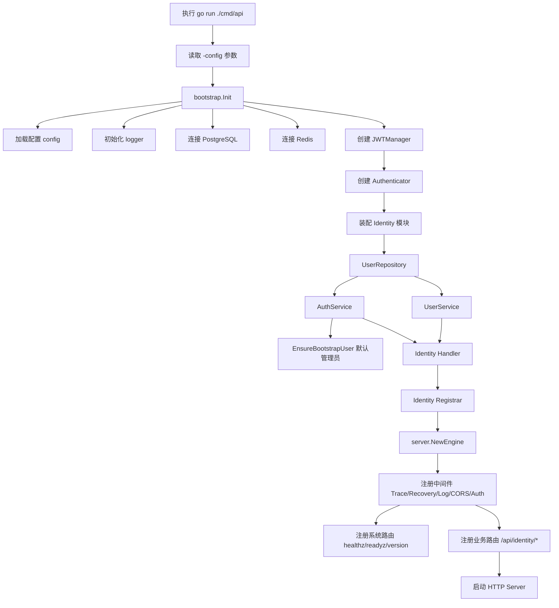
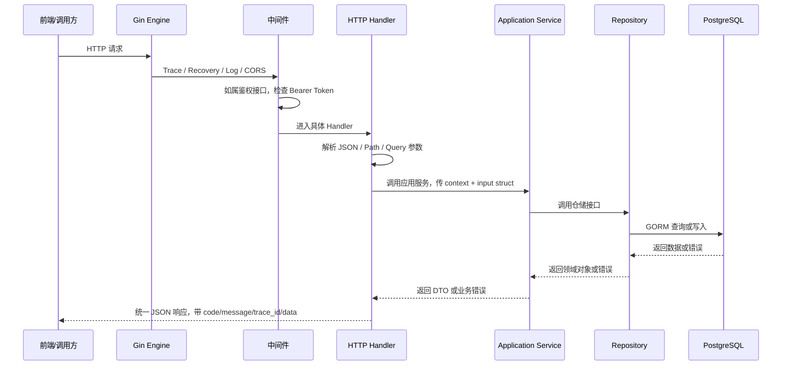
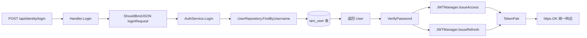
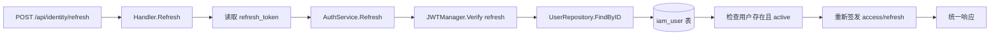
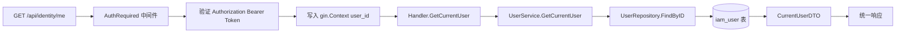
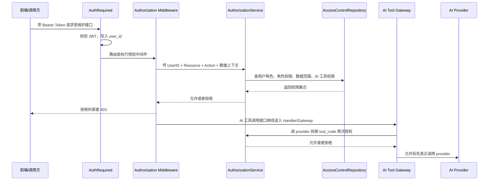
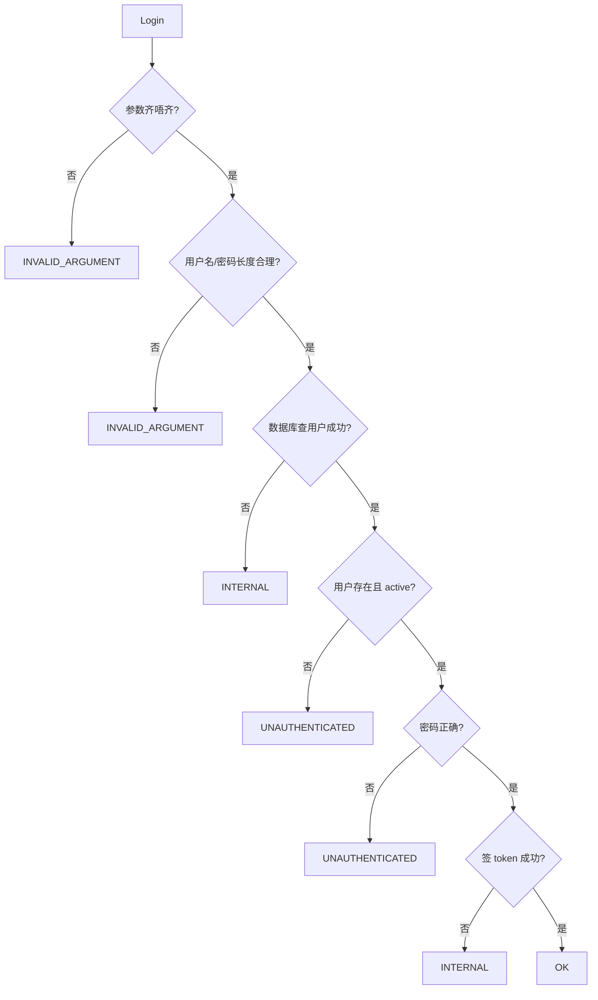
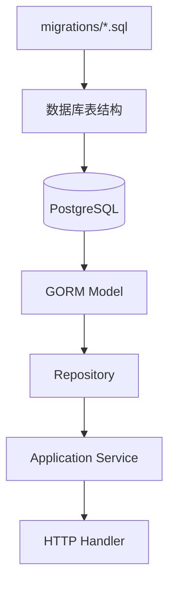
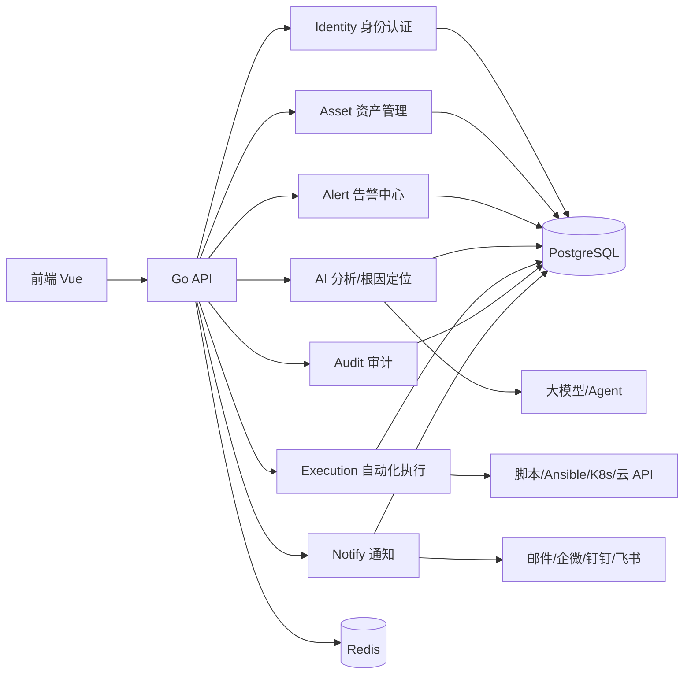
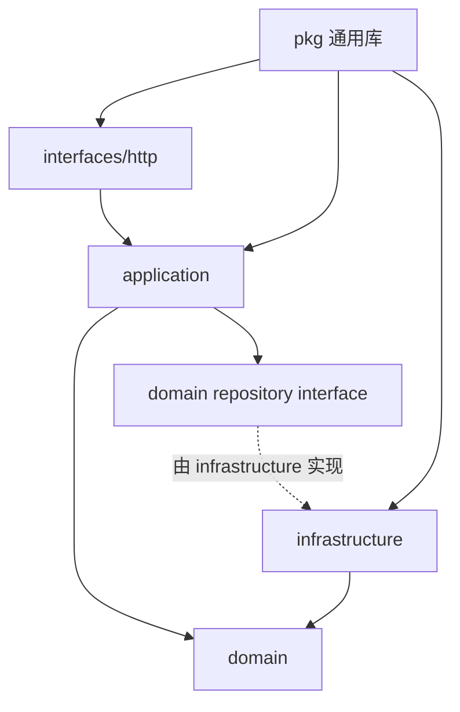

# AI 运维平台模块关系同调用说明（粤语版）

> 呢份文档用比较通俗嘅粤语，讲清楚而家呢个项目嘅整体方向、各个模块做咩、点样互相调用、参数点传、咩情况下会报错。之后新增告警、资产、AI 分析、执行编排、审计等模块，都可以照住呢套模式扩展。

## 1. 一句话讲晒成个平台

呢个项目系一个 **AI 运维平台后端骨架**：

- 前端或者调用方发 HTTP 请求入嚟。
- `cmd/api/main.go` 负责启动程序同装配所有依赖。
- `internal/server` 负责 Gin 路由、中间件、健康检查、鉴权分组。
- `internal/identity` 而家负责用户登录、刷新 token、查当前用户、角色/权限查询，同统一授权服务。
- `internal/ai` 负责 AI provider 管理同工具调用网关，调用工具前会再次做权限校验。
- `pkg/*` 负责通用能力，例如配置、数据库、Redis、日志、JWT、统一错误、HTTP 响应、鉴权/授权中间件。
- PostgreSQL 存用户同业务数据，Redis 预留畀缓存、会话、限流等用途。

## 2. 当前整体目录作用

```text
aiops/
├── cmd/api/                         # 程序入口：读取配置、初始化依赖、启动 HTTP 服务
├── internal/                        # 项目内部业务代码，外部项目唔应该直接 import
│   ├── bootstrap/                   # 初始化配置、日志、数据库、Redis，负责启动前准备
│   ├── server/                      # Gin Engine、全局中间件、系统路由、业务路由注册
│   ├── version/                     # 版本号、commit、构建时间
│   └── identity/                    # 身份认证模块：登录、刷新 token、当前用户
│       ├── domain/                  # 领域模型同仓储接口，例如 User、UserRepository
│       ├── application/             # 应用服务，用例编排，例如 AuthService、UserService
│       ├── infrastructure/          # 基础设施实现，例如 GORM 用户仓储
│       └── interfaces/http/         # HTTP Handler 同路由注册
├── pkg/                             # 通用公共库，各模块都可以用
│   ├── auth/                        # JWT 签发/验证、密码 hash、鉴权适配器
│   ├── config/                      # YAML + 环境变量配置读取同校验
│   ├── database/                    # PostgreSQL、Redis、migration 相关
│   ├── errors/                      # 统一错误码同错误对象
│   ├── logger/                      # zap 日志，支持 trace_id
│   ├── pagination/                  # 通用分页参数
│   └── transport/http/              # 统一 HTTP 响应、中间件、健康检查结构
├── configs/                         # 配置样例
├── deployments/                     # Dockerfile、docker-compose
├── migrations/                      # 数据库迁移 SQL
├── ops/                             # 接口契约、运维契约说明
└── docs/                            # 设计文档；本文件夹用于未来方向同模块说明
```

## 3. 启动流程图



通俗讲：

1. 程序一开波，先搵配置文件。
2. 配置、日志、数据库、Redis 都准备好。
3. 用配置入面嘅 JWT secret 创建签 token 嘅工具。
4. 创建用户仓储、用户服务、认证服务、HTTP handler。
5. 将各模块路由注册到 Gin。
6. 开始监听 HTTP 请求。

## 4. HTTP 请求入嚟之后点行



关键点：

- Handler 只做「接参数、调服务、包响应」，唔写复杂业务。
- Application Service 负责业务流程，例如登录要查用户、验密码、签 token。
- Repository 负责同数据库沟通。
- `context.Context` 会一路传落去，用嚟带 trace_id、超时、取消信号。

## 5. 当前 Identity 模块详解

### 5.1 Identity 模块负责咩

而家 `identity` 主要做三件事：

| 功能 | 路由 | 是否要登录 | 说明 |
| --- | --- | --- | --- |
| 登录 | `POST /api/identity/login` | 否 | 用户名 + 密码换 access token / refresh token |
| 刷新 token | `POST /api/identity/refresh` | 否 | refresh token 换一对新 token |
| 当前用户 | `GET /api/identity/me` | 是 | 根据 access token 查当前用户资料 |

### 5.2 Login 调用链



请求参数：

```json
{
  "username": "admin",
  "password": "admin123"
}
```

参数点传：

1. 前端用 JSON body 传 `username` 同 `password`。
2. Handler 用 `ShouldBindJSON` 转成 `loginRequest`。
3. Handler 再转成 `application.LoginInput` 传畀 `AuthService.Login(ctx, input)`。
4. Service 内部 trim 用户名、检查长度、查数据库、验密码、签 token。

成功响应大概系：

```json
{
  "code": "OK",
  "message": "ok",
  "trace_id": "xxx",
  "data": {
    "access_token": "xxx",
    "refresh_token": "xxx",
    "access_expires_at": 1710000000,
    "refresh_expires_at": 1710600000,
    "token_type": "Bearer",
    "user": {
      "id": "用户ID",
      "username": "admin",
      "display_name": "管理员",
      "email": "",
      "status": "active"
    }
  }
}
```

### 5.3 Refresh 调用链



请求参数：

```json
{
  "refresh_token": "之前登录攞到嘅 refresh token"
}
```

### 5.4 当前用户 me 调用链



请求 Header：

```text
Authorization: Bearer <access_token>
```

## 6. 鉴权同路由分组关系

`internal/server/router.go` 入面将 `/api` 分成两组：

```mermaid
flowchart TD
    A[/api] --> B[Public Group]
    A --> C[Authed Group]
    B --> D[AuthOptional]
    C --> E[AuthRequired]
    D --> F[登录、刷新 token 等允许匿名接口]
    E --> G[me、未来资产/告警/执行等需要登录接口]
```

- `Public`：可以冇 token，例如登录、刷新 token。
- `Authed`：一定要有合法 `Authorization: Bearer xxx`，否则中间件直接返回 401，业务 handler 唔会执行。

未来新增模块时，只要实现 `RouteRegistrar`，将路由挂去 `groups.Public` 或 `groups.Authed` 即可。

## 7. 今日已完善：统一权限校验链路

今日呢一步主要系将「只验证登录态」升级成「登录态 + 统一授权」。而家权限链路会喺路由、中间件、应用服务同 AI 工具调用网关几个位置一齐生效。

### 7.1 整体调用链



### 7.2 四层分别做咩

1. **路由层**：各模块 `routes.go` 明确声明接口需要嘅 `resource/action`，例如 `ai.providers:read`、`ai.tools:invoke`、`identity.roles:read`。
2. **中间件层**：`pkg/transport/http/middleware/authorization.go` 负责统一拦截，请求未通过授权时直接返回 `PERMISSION_DENIED`，唔进入业务 handler。
3. **应用服务层**：`internal/identity/application.AuthorizationService` 统一聚合 RBAC、数据范围、操作权限、AI 工具权限，并返回 matched roles / permissions / scopes，方便之后做审计。
4. **AI 工具网关层**：`internal/ai/toolgateway.Gateway` 喺真正调用 provider 前，会按请求入面嘅 `tool_code/resource/action/owner/dept/team/region/tags/confirmed` 再校验一次，防止绕过 HTTP 路由直接调工具网关。

### 7.3 而家已经挂咗授权嘅接口

- Identity：`GET /api/identity/roles`、`GET /api/identity/permissions`、`GET /api/identity/me`、`GET /api/identity/me/roles`、`POST /api/identity/authorize`。
- AI Provider：`GET /api/ai/providers`、`POST /api/ai/providers`、`DELETE /api/ai/providers/:id`。
- AI Tool：`POST /api/ai/tools/invoke`，路由层要求工具调用权限，网关层再按具体工具码做二次判断。

### 7.4 权限判断规则

- **RBAC / 操作权限**：如果请求有 `resource/action`，会拼成 `app:<resource>:<action>`，用户角色权限集合入面必须存在同名权限码。
- **显式权限**：如果请求传咗 `required_permission`，就必须命中该权限码。
- **数据权限**：角色数据范围至少要匹配一个范围；`all` 直接通过，`department/team/region/tag/custom` 分别根据对象部门、团队、区域、标签或 owner 上下文判断。
- **AI 工具权限**：`tool_code` 必须命中角色绑定嘅 AI 工具权限；`deny` 直接拒绝，`require_confirm` 会结合 `confirmed/allow_confirm` 判断。

## 8. 参数系点传落去嘅

### 7.1 Body 参数

用于 `POST/PUT/PATCH`，例如登录：

```text
HTTP JSON Body -> Handler request struct -> Application input struct -> Service 方法
```

例子：

```text
{"username":"admin","password":"admin123"}
-> loginRequest{Username, Password}
-> LoginInput{Username, Password}
-> AuthService.Login(ctx, input)
```

### 7.2 Header 参数

用于鉴权、trace 等：

```text
Authorization Header -> Auth 中间件 -> 校验 JWT -> gin.Context 写入 user_id -> Handler 读取 user_id
```

### 7.3 Query 参数

当前项目预留咗 `pkg/pagination`，之后列表接口会常用：

```text
GET /api/assets?page=1&page_size=20&keyword=nginx
```

一般会由 Handler 解析 query，再传到 Application Service。

### 7.4 Path 参数

之后资源详情接口会常用：

```text
GET /api/assets/{asset_id}
```

Handler 用 Gin 读取 path 参数，然后传到 Service，例如：

```text
assetID := c.Param("asset_id")
service.GetAsset(ctx, assetID)
```

## 8. 统一响应格式

所有接口最好都用 `pkg/transport/http` 入面嘅响应封装，统一返回：

```json
{
  "code": "OK 或错误码",
  "message": "畀人睇嘅说明",
  "trace_id": "链路追踪 ID",
  "data": {}
}
```

好处：

- 前端只需要按同一套格式处理。
- 出错时可以凭 `trace_id` 去日志搵对应请求。
- 未来接入网关、监控、审计会简单好多。

## 9. 会点样报错

错误码定义喺 `pkg/errors/code.go`。常见错误如下：

| 错误码 | HTTP 状态 | 通俗解释 | 常见场景 |
| --- | ---: | --- | --- |
| `INVALID_ARGUMENT` | 400 | 参数唔啱 | JSON 缺字段、用户名为空、token 太长 |
| `UNAUTHENTICATED` | 401 | 未登录或者登录失败 | 密码错、token 过期、refresh token 无效 |
| `PERMISSION_DENIED` | 403 | 冇权限 | 未来 RBAC 权限不足 |
| `NOT_FOUND` | 404 | 搵唔到 | 路由不存在、用户/资产不存在 |
| `ALREADY_EXISTS` | 409 | 已经存在 | 用户名重复、资源重复 |
| `FAILED_PRECONDITION` | 412 | 前置条件唔满足 | 未来执行任务前状态唔允许 |
| `RESOURCE_EXHAUSTED` | 429 | 资源用爆/限流 | 未来 API 限流、额度不足 |
| `UNAVAILABLE` | 503 | 服务暂时不可用 | 鉴权服务未配置、DB/Redis 未就绪 |
| `INTERNAL` | 500 | 系统内部错误 | 数据库异常、签 token 失败、未知错误 |

### 9.1 登录会报错嘅情况



重点：用户不存在、密码错、用户禁用，都会统一报 `UNAUTHENTICATED`，避免畀攻击者估到用户名存唔存在。

### 9.2 Refresh 会报错嘅情况

- `refresh_token` 冇传：`INVALID_ARGUMENT`
- `refresh_token` 太长：`INVALID_ARGUMENT`
- token 过期、伪造、类型唔系 refresh：`UNAUTHENTICATED`
- token 入面嘅用户已经删除或禁用：`UNAUTHENTICATED`
- 查数据库失败：`INTERNAL`

### 9.3 readyz 会报错/降级嘅情况

`GET /readyz` 会检查：

- 配置是否合法。
- migration 有冇未执行。
- PostgreSQL 可唔可以 ping 通。
- Redis 可唔可以 ping 通。

如果其中一项唔 OK，就会喺响应入面显示对应 check 嘅状态同 error。呢个接口好适合部署平台或者健康检查用。

## 10. 数据库同迁移关系



而家身份模块主要依赖 `iam_user` 表。以后新增模块建议每个模块有自己嘅表，例如：

- `asset`：资产主机、服务、应用。
- `alert`：告警事件。
- `incident`：故障单/事件单。
- `ai_analysis`：AI 分析结果。
- `execution_task`：自动化执行任务。
- `audit_log`：审计日志。

## 11. 未来整体方向建议



推荐未来模块拆法：

| 模块 | 作用 | 典型接口 |
| --- | --- | --- |
| Identity | 登录、用户、角色、权限 | `/api/identity/*` |
| Asset | 管主机、服务、应用、集群 | `/api/assets/*` |
| Alert | 接收告警、告警降噪、告警聚合 | `/api/alerts/*` |
| Incident | 故障事件闭环 | `/api/incidents/*` |
| AI Analysis | 日志/指标/告警分析，生成建议 | `/api/ai/analysis/*` |
| Execution | 自动化修复、脚本执行、审批 | `/api/executions/*` |
| Audit | 记录边个喺几时做咗咩 | `/api/audit-logs/*` |
| Notify | 通知渠道同消息模板 | `/api/notifications/*` |

## 12. 新增一个业务模块应该点做

假设新增 `asset` 模块，可以照住 `identity` 抄结构：

```text
internal/asset/
├── domain/
│   ├── asset.go              # 领域对象
│   └── repository.go         # 仓储接口
├── application/
│   └── asset_service.go      # 用例，例如 CreateAsset/ListAssets/GetAsset
├── infrastructure/
│   └── persistence/
│       └── asset_repository.go
└── interfaces/http/
    ├── handler.go            # 参数解析 + 响应
    └── routes.go             # 注册路由
```

新增步骤：

1. 先写 migration，建表。
2. 写 domain model 同 repository interface。
3. 写 GORM repository 实现。
4. 写 application service，放业务规则。
5. 写 HTTP handler，负责参数同响应。
6. 写 registrar，将路由挂到 `groups.Authed` 或 `groups.Public`。
7. 喺 `cmd/api/main.go` 装配仓储、服务、handler、registrar。

## 13. 模块之间关系应该点控制

建议遵守呢个方向：



简单讲：

- HTTP 层可以调用 Application。
- Application 可以调用 Domain 同 Repository 接口。
- Infrastructure 实现 Repository 接口。
- Domain 唔应该依赖 HTTP、GORM、Gin 呢啲外部框架。
- `server` 唔应该知道每个业务模块里面点写，只识得 `RouteRegistrar`。

## 14. 开发同排错建议

### 14.1 如果接口 404

可能原因：

- 路由冇注册到 Registrar。
- Registrar 冇加到 `cmd/api/main.go` 嘅 `registrars` 数组。
- 请求路径写错，例如漏咗 `/api`。

### 14.2 如果接口 401

可能原因：

- 请求需要登录，但冇带 `Authorization`。
- Header 格式唔啱，应该系 `Bearer <token>`。
- access token 过期。
- JWT secret 改咗，旧 token 全部失效。

### 14.3 如果登录失败

可能原因：

- 用户名或密码错。
- 用户状态唔系 active。
- 默认管理员冇创建成功。
- 数据库连接异常。

### 14.4 如果 `/readyz` 唔 ready

睇返回入面边个 check 出错：

- `config`：配置缺字段或格式唔啱。
- `migration`：有 SQL migration 未执行。
- `db`：PostgreSQL 连唔上。
- `redis`：Redis 连唔上。

## 15. 最后总结

而家呢个项目已经有一套几清晰嘅后端骨架：

```text
入口 main -> bootstrap 初始化 -> 装配模块 -> server 注册路由 -> middleware 统一处理 -> handler 接参数 -> service 做业务 -> repository 查数据库 -> httpx 统一响应
```

以后无论加资产、告警、AI 分析、执行编排，最好都跟住同一套分层方式。咁做嘅好处系：

- 代码清楚，边层做咩一眼睇到。
- 模块之间唔会乱依赖。
- 参数、错误、响应统一，前后端联调容易。
- 未来要拆微服务或者接入 AI Agent，都有比较稳阵嘅基础。
