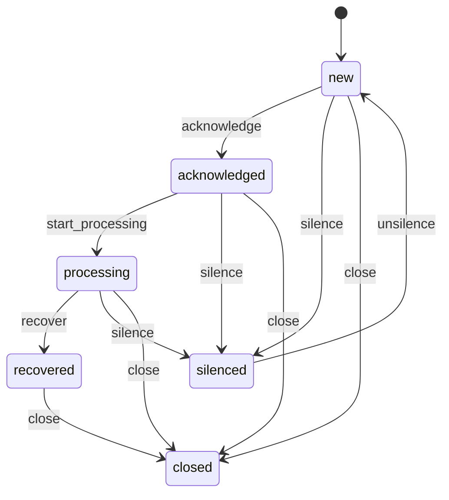
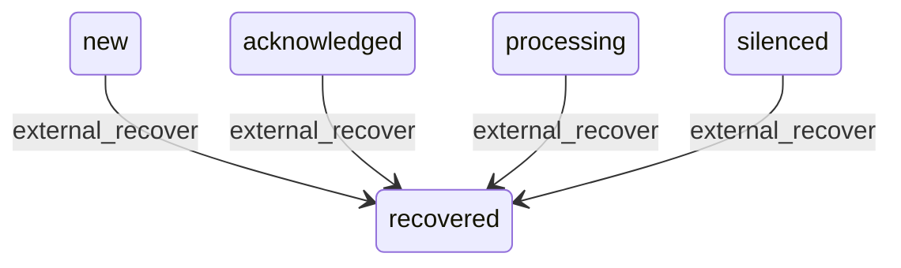

# Alert 告警中心工程契约

本文档定义 Alert 模块的稳定工程契约，供后端实现、前端联调、Webhook 接入和后续 AI / Execution / Audit 串联参考。

现有产品与架构约定来源：

- `docs/AI运维平台技术架构设计.md` §4.4、§9.2、§10
- `docs/AI运维平台项目工程需求文档.md` §4.3
- `docs/AI运维平台核心业务流程图.md` §4
- `docs/AI运维平台页面原型.md` §6、§7

## 1. 范围

第一阶段 Alert 模块先覆盖：

- 接收外部告警，优先支持 Prometheus Alertmanager Webhook。
- 将不同来源告警标准化为平台内部 `Alert`。
- 按稳定去重键生成或更新告警记录。
- 支持告警列表、详情、时间线、基础状态流转。
- 支持认领、转派、开始处理、手动恢复、关闭、静默、取消静默、备注。
- 为 AI 分析、执行任务、审计日志预留稳定关联字段。

第一阶段暂不实现：

- 告警规则管理 UI。
- 复杂降噪策略编排。
- 多层事件聚合/Incident 自动生成。
- 通知渠道模板管理。
- 由平台主动调用云厂商 API 拉取告警。

## 2. 统一响应格式

与平台其它接口一致，使用 `httpx.OK` / `httpx.Fail` 封装；成功时 `code` 为字符串 `"OK"`。

| 字段 | 类型 | 说明 |
| --- | --- | --- |
| `code` | string | 成功为 `"OK"`；失败为业务错误码 |
| `message` | string | 成功为 `"ok"` |
| `trace_id` | string | 请求追踪 ID |
| `data` | object | 业务数据 |

分页接口统一返回 `PageData<T>`：

| 字段 | 类型 | 说明 |
| --- | --- | --- |
| `items` | array\<T\> | 列表数据 |
| `total` | number | 总条数 |
| `page` | number | 页码，从 `1` 开始 |
| `page_size` | number | 每页条数，最大 `100` |

## 3. 鉴权与权限

### 3.1 管理与查询接口

除 Webhook 接入接口外，所有 `/api/alerts/**` 接口都要求：

```http
Authorization: Bearer <access_token>
```

建议权限种子如下，格式继续沿用 `app:{resource}:{action}`：

| 权限 code | resource | action | 说明 |
| --- | --- | --- | --- |
| `app:alerts:read` | `alerts` | `read` | 查看告警列表、详情、时间线 |
| `app:alerts:acknowledge` | `alerts` | `acknowledge` | 认领告警 |
| `app:alerts:assign` | `alerts` | `assign` | 转派告警 |
| `app:alerts:update` | `alerts` | `update` | 开始处理、恢复、备注等普通处理动作 |
| `app:alerts:close` | `alerts` | `close` | 关闭告警 |
| `app:alerts:silence` | `alerts` | `silence` | 静默与取消静默 |
| `app:alerts:ingest` | `alerts` | `ingest` | 管理接入源，非 Webhook 调用权限 |

授权失败返回 `PERMISSION_DENIED`（HTTP 403）。未登录或 token 无效返回 `UNAUTHENTICATED`（HTTP 401）。

### 3.2 Webhook 接入接口

Webhook 接入接口不使用 Bearer token，避免外部监控系统和用户登录体系耦合。第一阶段建议使用共享密钥：

```http
X-AIOPS-Webhook-Token: <source secret>
```

服务端必须：

- 按 `source_id` 找到启用中的接入源。
- 校验 token，失败返回 `UNAUTHENTICATED`。
- 限制请求体大小，建议默认 `1MB`。
- 记录来源 IP、User-Agent、trace_id。
- 对重复请求做幂等处理：`X-Request-ID` 短期幂等键（`source_id + request_id`）。生产多实例须 Redis 共享；`redis.required=false` 单实例开发可降级进程内 MemoryStore（与平台 health 契约一致，不阻塞启动）。

后续可以扩展 HMAC 签名：

```http
X-AIOPS-Signature: sha256=<hex>
X-AIOPS-Timestamp: 1710000000
```

## 4. 领域枚举

### 4.1 告警级别

API 内部枚举使用小写，前端展示可以转成大写。

| 值 | 展示 | 说明 |
| --- | --- | --- |
| `p0` | P0 | 严重故障，核心业务不可用或大范围影响 |
| `p1` | P1 | 高危问题，关键服务明显异常 |
| `p2` | P2 | 中等问题，局部影响或有劣化趋势 |
| `p3` | P3 | 低优先级问题，需要跟进但不紧急 |
| `info` | Info | 信息类提醒 |

级别归一化建议：

| 外部值 | 平台值 |
| --- | --- |
| `critical` / `fatal` / `emergency` / `p0` | `p0` |
| `high` / `major` / `warning` / `p1` | `p1` |
| `medium` / `minor` / `p2` | `p2` |
| `low` / `notice` / `p3` | `p3` |
| `info` / `none` | `info` |

### 4.2 告警状态

| 值 | 展示 | 说明 |
| --- | --- | --- |
| `new` | 新建 | 新告警或恢复后再次触发，未有人认领 |
| `acknowledged` | 已认领 | 已有人接手，但未开始处理 |
| `processing` | 处理中 | 已进入处理过程 |
| `recovered` | 已恢复 | 外部系统已恢复，等待确认关闭 |
| `closed` | 已关闭 | 告警处理完毕，最终态 |
| `silenced` | 已静默 | 告警暂时不提醒，但仍可继续接收更新 |

状态机（人工操作，API 用户动作）：



外部接入 resolved（`external_recover`，Webhook / 集成触发，非用户 API）：



| 动作 | 触发方 | 允许流转 |
| --- | --- | --- |
| `recover` | 用户 API（`POST .../recover`） | 仅 `processing → recovered` |
| `external_recover` | 外部 Webhook resolved | `new` / `acknowledged` / `processing` / `silenced → recovered` |

约束：

- `closed` 为最终态；外部同一 `dedup_key` 再次 firing 时，应创建新一轮告警或 reopen，第一阶段建议创建新记录。
- `recovered` 表示外部已恢复，但平台仍保留人工关闭动作。
- `silenced` 不等于关闭；静默期间仍更新 `last_seen_at`、`occurrence_count`。
- 人工 `recover` 与外部 `external_recover` 分流：前者遵守上表「人工操作」状态图；后者允许 active 态（含 `silenced`）直接进入 `recovered`，并清除 `silenced_until`，无需先 `unsilence`。
- 外部 `external_recover` 写 `recovered` 事件；`recovered` 重复到达保持幂等，不重复写无意义事件（见 §7.2）。

### 4.3 告警事件类型

| 值 | 说明 |
| --- | --- |
| `triggered` | 首次触发 |
| `updated` | 同一告警重复触发或标签/注解更新 |
| `recovered` | 外部恢复或手动标记恢复 |
| `acknowledged` | 用户认领 |
| `assigned` | 转派负责人 |
| `processing_started` | 开始处理 |
| `closed` | 关闭 |
| `silenced` | 静默 |
| `unsilenced` | 取消静默 |
| `commented` | 添加备注 |
| `ai_analysis_requested` | 发起 AI 分析 |
| `execution_created` | 基于告警创建执行任务 |
| `execution_started` | 执行任务开始运行 |
| `execution_finished` | 执行任务结束（success/failed） |

## 5. 领域模型

### 5.1 `Alert`

`Alert` 是告警中心的主记录，一条记录代表一轮可处理的告警生命周期。

| 字段 | 类型 | 必有 | 说明 |
| --- | --- | --- | --- |
| `id` | string | 是 | 告警业务 ID，建议 UUID |
| `external_id` | string | 否 | 外部系统告警 ID；无外部 ID 时可为空 |
| `source` | string | 是 | 来源类型，如 `prometheus_alertmanager` |
| `source_id` | string | 否 | 平台接入源 ID，如 `prod-alertmanager` |
| `source_name` | string | 否 | 来源显示名 |
| `fingerprint` | string | 是 | 外部指纹或平台计算指纹 |
| `dedup_key` | string | 是 | 平台去重键，必须稳定 |
| `name` | string | 是 | 告警名称 |
| `summary` | string | 否 | 一句话摘要 |
| `description` | string | 否 | 详细描述 |
| `severity` | string | 是 | `p0` / `p1` / `p2` / `p3` / `info` |
| `status` | string | 是 | 当前状态 |
| `rule_id` | string | 否 | 外部规则 ID |
| `rule_name` | string | 否 | 外部规则名称 |
| `business_line` | string | 否 | 业务线 |
| `environment` | string | 否 | 环境，如 `prod` / `staging` / `dev` |
| `application_id` | string | 否 | 关联应用 ID |
| `application_name` | string | 否 | 关联应用名 |
| `resource_id` | string | 否 | 关联资源 ID |
| `resource_type` | string | 否 | 资源类型，如 `host` / `pod` / `service` |
| `resource_name` | string | 否 | 资源名称 |
| `owner_user_id` | string | 否 | 归属负责人 |
| `assignee_user_id` | string | 否 | 当前处理人 |
| `labels` | object | 是 | 标准化后标签，空时返回 `{}` |
| `annotations` | object | 是 | 标准化后注解，空时返回 `{}` |
| `occurrence_count` | number | 是 | 同一告警重复触发次数 |
| `first_seen_at` | number | 是 | 首次触发时间，Unix 秒 |
| `last_seen_at` | number | 是 | 最近一次触发/更新，Unix 秒 |
| `recovered_at` | number | 否 | 恢复时间，Unix 秒 |
| `acknowledged_at` | number | 否 | 认领时间，Unix 秒 |
| `closed_at` | number | 否 | 关闭时间，Unix 秒 |
| `silenced_until` | number | 否 | 静默截止时间，Unix 秒 |
| `created_at` | number | 是 | 创建时间，Unix 秒 |
| `updated_at` | number | 是 | 更新时间，Unix 秒 |

### 5.2 `AlertEvent`

`AlertEvent` 记录告警时间线，用户操作、外部恢复、AI 分析入口都应该落一条事件。

| 字段 | 类型 | 必有 | 说明 |
| --- | --- | --- | --- |
| `id` | string | 是 | 事件业务 ID |
| `alert_id` | string | 是 | 所属告警 ID |
| `event_type` | string | 是 | 见 §4.3 |
| `actor_type` | string | 是 | `system` / `user` / `integration` |
| `actor_id` | string | 否 | 用户 ID 或接入源 ID |
| `actor_name` | string | 否 | 展示名 |
| `message` | string | 否 | 时间线展示文案 |
| `payload` | object | 是 | 结构化扩展数据，空时返回 `{}` |
| `created_at` | number | 是 | 创建时间，Unix 秒 |

### 5.3 `AlertSource`

`AlertSource` 是外部接入源配置；第一阶段可以先只落 Alertmanager。

| 字段 | 类型 | 必有 | 说明 |
| --- | --- | --- | --- |
| `id` | string | 是 | 接入源 ID |
| `name` | string | 是 | 显示名 |
| `type` | string | 是 | `prometheus_alertmanager` / `huawei_ces` / `signoz` / `zabbix` / `custom_webhook` |
| `enabled` | boolean | 是 | 是否启用 |
| `secret_masked` | string | 否 | 密钥掩码，接口永远不返回明文 |
| `environment` | string | 否 | 默认环境 |
| `business_line` | string | 否 | 默认业务线 |
| `description` | string | 否 | 备注 |
| `created_at` | number | 是 | 创建时间，Unix 秒 |
| `updated_at` | number | 是 | 更新时间，Unix 秒 |

### 5.4 `AlertSilence`

第一阶段可只实现轻量静默，复杂 matcher 后续再扩展。

| 字段 | 类型 | 必有 | 说明 |
| --- | --- | --- | --- |
| `id` | string | 是 | 静默业务 ID |
| `alert_id` | string | 否 | 针对单条告警静默 |
| `matcher` | object | 否 | 后续扩展标签 matcher |
| `reason` | string | 是 | 静默原因 |
| `starts_at` | number | 是 | 开始时间，Unix 秒 |
| `ends_at` | number | 是 | 结束时间，Unix 秒 |
| `created_by` | string | 是 | 创建人用户 ID |
| `created_at` | number | 是 | 创建时间，Unix 秒 |

## 6. 接入契约

### 6.1 Prometheus Alertmanager Webhook

- Method: `POST`
- Path: `/api/alerts/ingest/alertmanager/:source_id`
- 鉴权: 否（使用 `X-AIOPS-Webhook-Token`）

#### 请求头

| Header | 必填 | 说明 |
| --- | --- | --- |
| `X-AIOPS-Webhook-Token` | 是 | 接入源共享密钥 |
| `X-Request-ID` | 否 | 外部请求 ID；有则用于辅助幂等 |

#### 请求体

兼容 Alertmanager 默认 Webhook payload，核心字段如下：

| 字段 | 类型 | 必填 | 说明 |
| --- | --- | --- | --- |
| `receiver` | string | 否 | Alertmanager receiver |
| `status` | string | 是 | `firing` / `resolved` |
| `alerts` | array | 是 | 告警数组 |
| `groupLabels` | object | 否 | 分组标签 |
| `commonLabels` | object | 否 | 公共标签 |
| `commonAnnotations` | object | 否 | 公共注解 |
| `externalURL` | string | 否 | Alertmanager 地址 |

单条 `alerts[]` 映射：

| Alertmanager 字段 | 平台字段 | 说明 |
| --- | --- | --- |
| `fingerprint` | `fingerprint` / `external_id` | 优先使用外部 fingerprint |
| `status` | 状态事件 | `firing` 触发/更新，`resolved` 恢复 |
| `labels.alertname` | `name` / `rule_name` | 告警名 |
| `labels.severity` | `severity` | 按 §4.1 归一化 |
| `labels.env` / `labels.environment` | `environment` | 环境 |
| `labels.business_line` / `labels.team` | `business_line` | 业务线 |
| `labels.service` / `labels.app` / `labels.application` | `application_name` | 应用 |
| `labels.instance` / `labels.pod` / `labels.node` | `resource_name` | 资源 |
| `annotations.summary` | `summary` | 摘要 |
| `annotations.description` | `description` | 描述 |
| `startsAt` | `first_seen_at` | 首次触发 |
| `endsAt` | `recovered_at` | 恢复时间 |

#### 响应 `data`

| 字段 | 类型 | 说明 |
| --- | --- | --- |
| `accepted` | number | 接收数量 |
| `created` | number | 新建告警数量 |
| `updated` | number | 更新告警数量 |
| `recovered` | number | 恢复告警数量 |
| `ignored` | number | 无效 payload、无 active 的 resolved、已 recovered 重复 resolved 等忽略数量（**不**含静默忽略；§4.2 静默期间仍更新 `last_seen_at` / `occurrence_count`） |

响应示例：

```json
{
  "code": "OK",
  "message": "ok",
  "trace_id": "abc123",
  "data": {
    "accepted": 2,
    "created": 1,
    "updated": 1,
    "recovered": 0,
    "ignored": 0
  }
}
```

### 6.2 通用 Webhook

- Method: `POST`
- Path: `/api/alerts/ingest/webhook/:source_id`
- 鉴权: 否（使用 `X-AIOPS-Webhook-Token`）

通用 Webhook 请求体建议直接贴近平台标准字段：

```json
{
  "external_id": "alert-123",
  "status": "firing",
  "name": "CPU 使用率过高",
  "severity": "p1",
  "summary": "payment-service CPU > 85%",
  "description": "CPU 使用率连续 5 分钟超过阈值",
  "business_line": "payment",
  "environment": "prod",
  "application_name": "payment-service",
  "resource_type": "pod",
  "resource_name": "payment-xxx-1",
  "labels": {
    "cluster": "prod-01",
    "namespace": "payment"
  },
  "annotations": {
    "runbook_url": "https://example.com/runbook"
  },
  "starts_at": 1710000000,
  "ends_at": 0
}
```

## 7. 去重与幂等

### 7.1 去重键

平台必须为每条接入告警生成 `dedup_key`。

优先级：

1. 如果外部提供稳定 `external_id` 或 `fingerprint`：  
   `dedup_key = sha256(source_id + "\x00" + external_id_or_fingerprint)`
2. 如果无稳定外部 ID：  
   `dedup_key = sha256(source_id + "\x00" + rule_name + "\x00" + resource_name + "\x00" + selected_labels)`

`selected_labels` 建议只纳入稳定标签：

- `alertname`
- `job`
- `instance`
- `cluster`
- `namespace`
- `pod`
- `node`
- `service`
- `app` / `application`
- `env` / `environment`

不建议纳入会频繁变化的标签，例如 request id、pod hash、message 文本。

### 7.2 幂等规则

- 同一 active 告警重复 firing：更新 `last_seen_at`、`labels`、`annotations`、`occurrence_count`，写 `updated` 事件。
- 同一告警 resolved：状态转 `recovered`，写 `recovered` 事件。
- 同一 resolved 重复到达：保持 `recovered`，不重复写无意义事件。
- `recovered` 后同一 `dedup_key` 再次 firing：重新打开当前 lifecycle，状态转 `new`，清 `recovered_at` 同认领/处理人信息，写 `triggered` 事件。
- `closed` 后同一 `dedup_key` 再次 firing：第一阶段创建新告警记录（新 lifecycle）。
- Webhook 响应 `ignored` 计数：空 `name`、无 active 告警时收到 `resolved`、已 `recovered` 重复 `resolved` 等；**静默告警 firing 仍走 `updated`，不计入 `ignored`**（§4.2）。
- Webhook 带 `X-Request-ID` 时，可将 `source_id + request_id` 作为短期幂等键；存储实现见 §3.2（生产 Redis，开发可 Memory）。
- 幂等缓存写入失败时，接口返回可重试错误（如 `503` / `UNAVAILABLE`），**不**对调用方伪装成功；同 key 并发请求在缩短的 processing 窗口内等待。极端情况下 marker 过期后仍无缓存时，后续重试可能再次执行 ingest（依赖调用方重试与告警 dedup_key 去重兜底）。

### 7.3 数据库唯一约束建议

第一阶段建议：

- `alert_alert.alert_id` 唯一。
- `alert_alert.dedup_key + lifecycle_seq` 唯一。
- active 告警查询索引：`status, severity, last_seen_at`。
- 来源查询索引：`source_id, external_id`。

如果数据库支持部分索引，可加 active dedup 约束：仅 `status != 'closed'` 时 `source_id + dedup_key` 唯一。

## 8. API 契约

### 8.1 告警列表

- Method: `GET`
- Path: `/api/alerts`
- 鉴权: 是（Bearer + `app:alerts:read`）

#### 查询参数

| 参数 | 类型 | 默认值 | 说明 |
| --- | --- | --- | --- |
| `page` | number | `1` | 页码 |
| `page_size` | number | `20` | 每页条数，最大 `100` |
| `status` | string | 空 | 状态筛选，可多值逗号分隔 |
| `severity` | string | 空 | 级别筛选，可多值逗号分隔 |
| `source` | string | 空 | 来源类型 |
| `source_id` | string | 空 | 接入源 ID |
| `business_line` | string | 空 | 业务线 |
| `environment` | string | 空 | 环境 |
| `application_id` | string | 空 | 应用 ID |
| `resource_id` | string | 空 | 资源 ID |
| `assignee_user_id` | string | 空 | 处理人 |
| `keyword` | string | 空 | 搜索 `name` / `summary` / `resource_name` |
| `active_only` | boolean | `false` | 只查未关闭告警 |
| `from` | number | 空 | 首次触发起始时间，Unix 秒 |
| `to` | number | 空 | 首次触发结束时间，Unix 秒 |

#### 响应

返回 `PageData<Alert>`。

### 8.2 告警详情

- Method: `GET`
- Path: `/api/alerts/:alert_id`
- 鉴权: 是（Bearer + `app:alerts:read`）

响应 `data`：

| 字段 | 类型 | 说明 |
| --- | --- | --- |
| `alert` | Alert | 告警主记录 |
| `events` | array\<AlertEvent\> | 时间线事件，按时间升序 |
| `related` | object | 关联对象摘要，第一阶段可返回空对象 |

### 8.3 认领告警

- Method: `POST`
- Path: `/api/alerts/:alert_id/acknowledge`
- 鉴权: 是（Bearer + `app:alerts:acknowledge`）

请求体：

| 字段 | 类型 | 必填 | 说明 |
| --- | --- | --- | --- |
| `message` | string | 否 | 认领备注 |

约束：

- 允许状态：仅 `new`（§4.2 人工状态图；`silenced` 须先 `unsilence` 回到 `new`）。
- 成功后状态：`acknowledged`。
- 写入 `acknowledged` 事件。
- 非法状态返回 `INVALID_ARGUMENT`。

### 8.4 转派告警

- Method: `POST`
- Path: `/api/alerts/:alert_id/assign`
- 鉴权: 是（Bearer + `app:alerts:assign`）

请求体：

| 字段 | 类型 | 必填 | 说明 |
| --- | --- | --- | --- |
| `assignee_user_id` | string | 是 | 新处理人用户 ID |
| `message` | string | 否 | 转派原因 |

约束：

- 允许状态：除 `closed` 外均可转派（`new` / `acknowledged` / `processing` / `recovered` / `silenced`）。
- 成功后写入 `assigned` 事件。
- 非法状态（如 `closed`）返回 `INVALID_ARGUMENT`。

### 8.5 开始处理

- Method: `POST`
- Path: `/api/alerts/:alert_id/start-processing`
- 鉴权: 是（Bearer + `app:alerts:update`）

约束：

- 允许状态：`acknowledged`。
- 成功后状态：`processing`。
- 写入 `processing_started` 事件。

### 8.6 手动标记恢复

- Method: `POST`
- Path: `/api/alerts/:alert_id/recover`
- 鉴权: 是（Bearer + `app:alerts:update`）

请求体：

| 字段 | 类型 | 必填 | 说明 |
| --- | --- | --- | --- |
| `message` | string | 否 | 恢复说明 |

约束：

- 允许状态：仅 `processing`（§4.2 人工 `recover`；外部 Webhook resolved 走 `external_recover`，见 §4.2 / §7.2）。
- 成功后状态：`recovered`。
- 写入 `recovered` 事件。
- 非法状态返回 `INVALID_ARGUMENT`。

### 8.7 关闭告警

- Method: `POST`
- Path: `/api/alerts/:alert_id/close`
- 鉴权: 是（Bearer + `app:alerts:close`）

请求体：

| 字段 | 类型 | 必填 | 说明 |
| --- | --- | --- | --- |
| `resolution` | string | 是 | 关闭原因或处理结论 |

约束：

- 允许状态：`new` / `acknowledged` / `processing` / `recovered`（§4.2；`silenced` 须先 `unsilence`）。
- 成功后状态：`closed`。
- 写入 `closed` 事件。
- 非法状态返回 `INVALID_ARGUMENT`。

### 8.8 静默告警

- Method: `POST`
- Path: `/api/alerts/:alert_id/silence`
- 鉴权: 是（Bearer + `app:alerts:silence`）

请求体：

| 字段 | 类型 | 必填 | 说明 |
| --- | --- | --- | --- |
| `reason` | string | 是 | 静默原因 |
| `duration_s` | number | 是 | 静默时长，秒 |

约束：

- 允许状态：`new` / `acknowledged` / `processing`（§4.2 人工状态图；`recovered` / `closed` / `silenced` 不可静默，`silenced` 须先 `unsilence` 或走其它流转）。
- `duration_s` 必须大于 `0`，建议最大不超过 `30d`。
- 成功后状态：`silenced`。
- 写入 `silenced` 事件。
- 非法状态返回 `INVALID_ARGUMENT`。

### 8.9 取消静默

- Method: `POST`
- Path: `/api/alerts/:alert_id/unsilence`
- 鉴权: 是（Bearer + `app:alerts:silence`）

约束：

- 允许状态：`silenced`。
- 成功后状态：`new`。
- 写入 `unsilenced` 事件。
- 非法状态返回 `INVALID_ARGUMENT`。

### 8.10 添加备注

- Method: `POST`
- Path: `/api/alerts/:alert_id/comments`
- 鉴权: 是（Bearer + `app:alerts:update`）

请求体：

| 字段 | 类型 | 必填 | 说明 |
| --- | --- | --- | --- |
| `message` | string | 是 | 备注内容，建议最长 `2000` 字符 |

约束：

- 允许状态：除 `closed` 外均可备注。
- 成功后写入 `commented` 事件。
- 非法状态（如 `closed`）返回 `INVALID_ARGUMENT`。

### 8.11 发起 AI 分析入口

- Method: `POST`
- Path: `/api/alerts/:alert_id/ai-analysis`
- 鉴权: 是（Bearer + `app:alerts:update`）

请求体（均可选，省略时使用默认值）：

| 字段 | 类型 | 默认 | 说明 |
| --- | --- | --- | --- |
| `time_range` | string | `30m` | 分析时间范围 |
| `include_logs` | boolean | `false` | 是否包含日志 |
| `include_metrics` | boolean | `false` | 是否包含指标 |
| `include_changes` | boolean | `false` | 是否包含变更 |

约束：

- `closed` 告警不可发起。
- 成功后写入 `ai_analysis_requested` 时间线事件。
- 实际 AI 分析由前端再调 §9.2 `POST /api/ai/analyze-alert`（或后端编排调用）。

### 8.12 接入源管理

管理外部告警接入源（§5.3 `AlertSource`）；Webhook 路径参数 `:source_id` 即此处配置的 ID。接口返回 `secret_masked`，**永不**返回明文 `secret`。

- 鉴权: 是（Bearer + `app:alerts:ingest`）

#### 8.12.1 列表接入源

- Method: `GET`
- Path: `/api/alerts/sources`

响应 `data`：

| 字段 | 类型 | 说明 |
| --- | --- | --- |
| `items` | array\<AlertSource\> | 接入源列表 |

#### 8.12.2 获取接入源

- Method: `GET`
- Path: `/api/alerts/sources/:source_id`

响应 `data`：单条 `AlertSource`（含 `secret_masked`）。

#### 8.12.3 创建接入源

- Method: `POST`
- Path: `/api/alerts/sources`

请求体：

| 字段 | 类型 | 必填 | 说明 |
| --- | --- | --- | --- |
| `id` | string | 是 | 接入源 ID，用于 Webhook URL |
| `name` | string | 是 | 显示名 |
| `type` | string | 否 | 默认 `prometheus_alertmanager` |
| `enabled` | boolean | 否 | 默认 `true` |
| `secret` | string | 是 | Webhook 共享密钥（落库哈希，响应用掩码） |
| `environment` | string | 否 | 默认环境 |
| `business_line` | string | 否 | 默认业务线 |
| `description` | string | 否 | 备注 |

响应 `data`：创建后的 `AlertSource`。

#### 8.12.4 更新接入源

- Method: `PUT`
- Path: `/api/alerts/sources/:source_id`

请求体字段同创建，除 `id` 外均可选；`secret` 省略则保留原密钥。

响应 `data`：更新后的 `AlertSource`。

#### 8.12.5 删除接入源

- Method: `DELETE`
- Path: `/api/alerts/sources/:source_id`

响应 `data`：`{ "deleted": true }`。

## 9. 与其它模块关系

### 9.1 Asset

Alert 只保存关联资源/应用的快照字段，真正资源详情由 Asset 模块提供。

实现方式：

- Asset 模块维护 `asset_application` / `asset_resource` 注册表（`POST /api/assets/applications`、`POST /api/assets/resources`）。
- Alert 接入（`IngestService`）经 `AssetMatcher` port 按标签自动匹配。
- 匹配字段：`application_name` / `service` / `app` / `application`、`resource_name`、`namespace`、`pod`、`node`、`instance`。
- 匹配成功后写 `application_id` / `resource_id`；失败仍保存告警，前端显示「待关联资源」。

### 9.2 AI

推荐前端流程：

1. `POST /api/alerts/:alert_id/ai-analysis` — Alert 模块写 `ai_analysis_requested` 时间线事件（§8.11）。
2. `POST /api/ai/analyze-alert` — AI 模块返回分析结果（鉴权 `app:ai.analysis:analyze`）。

```http
POST /api/ai/analyze-alert
```

请求体至少包含：

```json
{
  "alert_id": "alert-001",
  "time_range": "30m",
  "include_logs": true,
  "include_metrics": true,
  "include_changes": true
}
```

响应示例（与技术架构设计 §6.3.1 对齐）：

```json
{
  "code": "OK",
  "message": "ok",
  "data": {
    "conversation_id": "conv-001",
    "summary": "payment-service CPU 持续升高，可能导致请求超时。",
    "risk_level": "medium",
    "recommendations": [],
    "references": []
  }
}
```

### 9.3 Execution

从告警创建执行任务时，Execution 任务应保留：

| 字段 | 说明 |
| --- | --- |
| `source_type` | 固定 `alert` |
| `source_id` | `alert_id` |
| `risk_level` | 由执行计划评估 |

Alert 时间线写 `execution_created` / `execution_started` / `execution_finished` 事件，payload 中保存 `execution_id` 与 `status`（结束时）。完整 API 见 `ops/execution-contract.md`。

### 9.4 Audit

用户对告警的关键操作应写审计（落库 `audit_operation`，查询 `GET /api/audits`）：

- 认领
- 转派
- 开始处理
- 静默 / 取消静默
- 手动恢复
- 关闭
- 发起 AI 分析入口
- 从告警创建执行任务（预留）

审计资源建议：

| 字段 | 值 |
| --- | --- |
| `resource_type` | `alert` |
| `resource_id` | `alert_id` |
| `action` | 对应操作，如 `close` / `silence` |

## 10. 错误语义

| code | HTTP | 场景 |
| --- | --- | --- |
| `INVALID_ARGUMENT` | 400 | 参数缺失、枚举非法、状态流转非法 |
| `UNAUTHENTICATED` | 401 | Bearer 无效，或 Webhook token 无效 |
| `PERMISSION_DENIED` | 403 | 用户无权限 |
| `NOT_FOUND` | 404 | 告警、接入源不存在 |
| `CONFLICT` | 409 | 幂等冲突、并发状态更新冲突 |
| `PAYLOAD_TOO_LARGE` | 413 | Webhook 请求体过大 |
| `UNAVAILABLE` | 503 | Alert 服务或依赖存储未配置；Webhook 幂等结果缓存写入失败（§7.2，可重试） |

状态流转非法统一返回 `INVALID_ARGUMENT`，message 可以带具体原因，例如：

```json
{
  "code": "INVALID_ARGUMENT",
  "message": "alert status cannot transition from closed to processing",
  "trace_id": "abc123"
}
```

## 11. 数据表建议

第一阶段建议最少落以下表：

| 表名 | 说明 |
| --- | --- |
| `alert_alert` | 告警主表 |
| `alert_event` | 告警时间线事件 |
| `alert_source` | 外部接入源配置 |
| `alert_silence` | 静默记录 |

字段落库建议：

- `labels`、`annotations`、`payload` 使用 `JSONB`。
- 业务 ID 使用 `VARCHAR(36)` 并建唯一索引。
- `dedup_key` 使用 `VARCHAR(128)` 或定长 hash。
- 时间字段统一使用 `TIMESTAMPTZ`，API 输出 Unix 秒。

## 12. 第一阶段验收标准

完成第一阶段时，至少满足：

- 能创建一个 Alertmanager 接入源，并配置共享 token。
- Alertmanager firing payload 能生成平台告警。
- 同一告警重复 firing 会更新原记录，而不是无限新增。
- resolved payload 能将告警转为 `recovered`。
- 用户可查看列表、详情与时间线。
- 用户可认领、开始处理、关闭、静默、取消静默。
- 每个状态动作都写 `AlertEvent`。
- 关键用户动作预留审计写入点。
- 告警详情可以跳转/调用 AI 分析入口。

### 12.1 联调验收记录（2026-06-13）

在远程 PostgreSQL + 本地 API/前端环境完成第一阶段 E2E（脚本 `scripts/e2e-alert.ps1`，默认 `admin/admin123` → `http://127.0.0.1:8080`）：

| 覆盖项 | 结果 |
| --- | --- |
| Alertmanager 接入源创建（`POST /api/alerts/sources`） | 通过 |
| Webhook firing 入库（`POST /api/alerts/ingest/alertmanager/:source_id`） | `created=1` |
| 重复 firing 去重更新 | `updated=1`，`occurrence_count` 递增 |
| resolved 自动恢复 | `status=recovered` |
| 列表 / 详情 / 时间线 | 通过 |
| 认领 → 开始处理 → 手动恢复 | 通过 |
| 关闭后新 firing 重新开单 | `created=1`，`status=new` |
| 转派（`POST /assign`） | 时间线含 `assigned` |
| 静默 / 取消静默（`POST /silence`、`/unsilence`） | `silenced` → `new` |
| AI 分析入口（`POST /ai-analysis` + `POST /api/ai/analyze-alert`） | 时间线含 `ai_analysis_requested`，返回 summary |

前端页面：`web/src/views/alerts/index.vue`（路由 `/alerts`），dev 代理至本地 API。

## 13. 后续扩展

第二阶段可以继续补：

- 华为云 CES 接入。
- SigNoz / 日志告警接入。
- Zabbix 接入。
- 告警规则与静默规则管理。
- 告警聚合成 Incident。
- 通知策略与升级策略。
- 告警降噪规则：时间窗口、标签聚合、维护窗口、重复压缩。
- 与 Asset 自动关联的更强 matcher。
