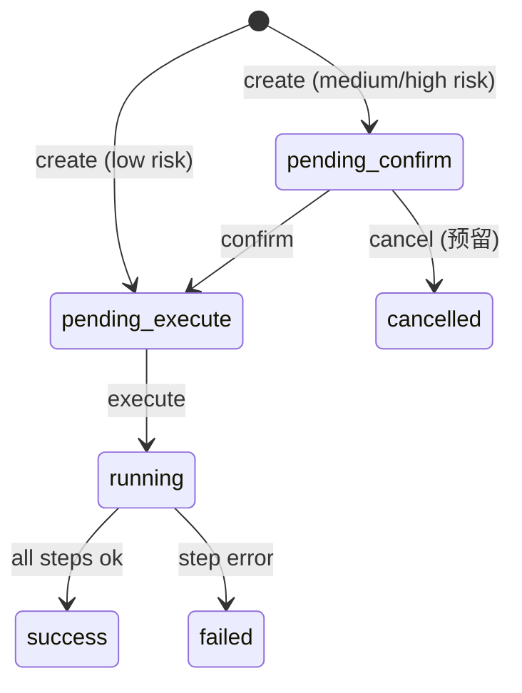

# Execution 执行任务工程契约

本文档定义 Execution 模块第一阶段工程契约，覆盖从告警创建执行任务、确认、执行、状态查询，以及结果回写告警时间线。

架构来源：

- `docs/AI运维平台技术架构设计.md` §4.8、§6.3.2
- `ops/alert-contract.md` §9.3

## 1. 范围

第一阶段覆盖：

- 创建执行任务（来源：`alert` / `manual`）。
- 风险等级评估与待确认状态流转。
- 同步模拟执行（无真实云厂商/集群适配器）。
- 任务列表、详情、步骤状态查询。
- 来源为 `alert` 时回写告警时间线：`execution_created`、`execution_started`、`execution_finished`。
- 关键操作写入 `audit_operation`。

第一阶段暂不做：

- 多级审批、回滚编排、执行代理调度。
- 任务模板、脚本库 UI。
- AI 会话来源自动建单（接口预留 `source_type=ai_conversation`）。

## 1.1 P1+ 执行介体与执行代理演进

当平台从“同步模拟执行”演进到真实诊断和处置时，Execution 模块将增加执行介体与执行代理能力。该能力用于支持 AI 分析后生成建议，运维人员确认后，在指定跳板机、诊断 VM、目标机器、Kubernetes Pod 或云厂商受控执行通道上执行命令或脚本。

关键约束：

- AI 只能生成执行计划和参数，不能直接执行命令。
- 前端不能直接 SSH、K8s exec、云 API 写操作或数据库写操作。
- 任意真实执行都必须创建 `exec_task`，进入 Execution 状态机。
- 中高风险动作仍必须 `pending_confirm -> CONFIRM -> pending_execute -> running`。
- 执行介体必须注册、授权、健康检查、能力匹配和审计。
- 命令必须匹配平台预置 Command Spec，并通过参数 schema 校验；禁止 AI 或前端提交任意自由 shell 字符串直接执行。

详细契约见 `ops/execution-agent-contract.md`。

## 2. 统一响应格式

与平台其它接口一致，成功时 `code` 为 `"OK"`。分页接口返回 `PageData<T>`（`items` / `total` / `page` / `page_size`）。

## 3. 鉴权与权限

所有 `/api/executions/**` 接口要求：

```http
Authorization: Bearer <access_token>
```

| 权限 code | resource | action | 说明 |
| --- | --- | --- | --- |
| `app:executions:read` | `executions` | `read` | 查看任务列表与详情 |
| `app:executions:create` | `executions` | `create` | 创建执行任务 |
| `app:executions:confirm` | `executions` | `confirm` | 确认待执行任务 |
| `app:executions:execute` | `executions` | `execute` | 触发执行 |

## 4. 领域枚举

### 4.1 任务状态

| 值 | 展示 | 说明 |
| --- | --- | --- |
| `pending_confirm` | 待确认 | 中高风险，需用户确认 |
| `pending_execute` | 待执行 | 已确认或低风险直进 |
| `running` | 执行中 | 正在运行步骤 |
| `success` | 成功 | 终态 |
| `failed` | 失败 | 终态 |
| `cancelled` | 已取消 | 终态（预留） |

状态机（第一阶段）：



### 4.2 来源类型

| 值 | 说明 |
| --- | --- |
| `alert` | 告警详情发起 |
| `manual` | 手动创建 |
| `ai_conversation` | AI 会话（预留） |
| `inspection` | 巡检建议或观测智能体发现（P1+ 预留） |

### 4.3 操作类型

| 值 | 说明 | 默认风险 |
| --- | --- | --- |
| `restart` | 重启服务/实例 | medium |
| `scale` | 扩缩容 | medium |
| `script` | 脚本执行 | low |
| `runbook` | 预案执行 | low |
| `command` | 受控命令执行（P1+，需 Command Spec） | medium |
| `diagnose` | 只读诊断动作（P1+） | low |
| `custom` | 自定义 | medium |

### 4.4 风险等级

`low` / `medium` / `high` / `critical`。第一阶段按 `operation_type` 映射，`low` 创建后直达 `pending_execute`，其余为 `pending_confirm`。

## 5. 领域模型

### 5.1 `ExecutionTask`

| 字段 | 类型 | 必有 | 说明 |
| --- | --- | --- | --- |
| `id` | string | 是 | 任务业务 ID（UUID） |
| `name` | string | 是 | 任务名称 |
| `source_type` | string | 是 | 来源类型 |
| `source_id` | string | 否 | 来源 ID（alert_id 等） |
| `operation_type` | string | 是 | 操作类型 |
| `target_type` | string | 否 | 目标类型 |
| `target_id` | string | 否 | 目标 ID |
| `target_name` | string | 否 | 目标名称快照 |
| `environment` | string | 否 | 环境 |
| `risk_level` | string | 是 | 风险等级 |
| `status` | string | 是 | 任务状态 |
| `parameters` | object | 是 | 执行参数，空 `{}` |
| `rollback_plan` | object | 否 | 回滚方案 |
| `result_summary` | string | 否 | 执行结果摘要 |
| `error_message` | string | 否 | 失败原因 |
| `created_by` | string | 是 | 创建人用户 ID |
| `confirmed_by` | string | 否 | 确认人 |
| `executed_by` | string | 否 | 执行触发人 |
| `created_at` | number | 是 | Unix 秒 |
| `confirmed_at` | number | 否 | Unix 秒 |
| `started_at` | number | 否 | Unix 秒 |
| `finished_at` | number | 否 | Unix 秒 |

### 5.2 `ExecutionStep`

| 字段 | 类型 | 必有 | 说明 |
| --- | --- | --- | --- |
| `id` | string | 是 | 步骤 ID |
| `task_id` | string | 是 | 所属任务 |
| `step_order` | number | 是 | 顺序，从 1 开始 |
| `name` | string | 是 | 步骤名称 |
| `action_type` | string | 是 | 动作类型 |
| `status` | string | 是 | `pending` / `running` / `success` / `failed` |
| `output` | object | 是 | 输出，空 `{}` |
| `error_message` | string | 否 | 错误信息 |
| `started_at` | number | 否 | Unix 秒 |
| `finished_at` | number | 否 | Unix 秒 |

## 6. HTTP API

### 6.1 创建任务

- Method: `POST`
- Path: `/api/executions/tasks`
- 权限: `app:executions:create`

请求体：

```json
{
  "name": "重启 payment-service",
  "source_type": "alert",
  "source_id": "alert-001",
  "operation_type": "restart",
  "target_type": "service",
  "target_id": "svc-payment",
  "target_name": "payment-service",
  "environment": "prod",
  "parameters": { "grace_period_s": 30 },
  "rollback_plan": { "description": "如异常持续，回滚到上一版本" },
  "risk_level": "medium"
}
```

可选 `risk_level`：未填时按 `operation_type` 与环境计算默认风险；仅允许指定不低于默认值的风险等级。

`source_type=alert` 时：

- `source_id` 必填，且告警状态必须为 `processing`。
- 未填 `name` / `target_*` / `environment` 时从告警快照补全。

响应 `data`：

```json
{
  "task_id": "task-001",
  "status": "pending_confirm",
  "risk_level": "medium",
  "confirm_url": "/executions?task_id=task-001"
}
```

同时向告警时间线写入 `execution_created`，`payload.execution_id` 为任务 ID。

### 6.2 任务列表

- Method: `GET`
- Path: `/api/executions/tasks`
- 权限: `app:executions:read`

查询参数：`page`、`page_size`、`status`、`source_type`、`source_id`、`keyword`。

### 6.3 任务详情

- Method: `GET`
- Path: `/api/executions/tasks/:task_id`
- 权限: `app:executions:read`

响应 `data`：

```json
{
  "task": { },
  "steps": [ ]
}
```

### 6.4 确认任务

- Method: `POST`
- Path: `/api/executions/tasks/:task_id/confirm`
- 权限: `app:executions:confirm`

请求体：

```json
{
  "confirm": true,
  "confirm_text": "CONFIRM"
}
```

`confirm_text` 必须为 `CONFIRM`（大小写敏感）。仅 `pending_confirm → pending_execute`。

### 6.5 执行任务

- Method: `POST`
- Path: `/api/executions/tasks/:task_id/execute`
- 权限: `app:executions:execute`

仅 `pending_execute → running → success|failed`。第一阶段为同步模拟执行。

来源为 `alert` 时：

- 开始执行写 `execution_started` 时间线事件。
- 结束写 `execution_finished`，`payload.status` 为 `success` 或 `failed`。

## 7. 与 Alert 关系

| 场景 | Alert 时间线事件 | payload 建议 |
| --- | --- | --- |
| 创建任务 | `execution_created` | `execution_id`, `operation_type`, `risk_level` |
| 开始执行 | `execution_started` | `execution_id`, `operation_type` |
| 执行结束 | `execution_finished` | `execution_id`, `status`, `result_summary` |

审计 `resource_type=execution`，`resource_id=task_id`；来源为 alert 时额外写 `resource_type=alert` 的 `execution_create` 动作。

## 8. 数据表

| 表名 | 说明 |
| --- | --- |
| `exec_task` | 执行任务主表 |
| `exec_step` | 执行步骤 |

迁移：`0011_init_execution.up.sql`。

### 8.1 数据完整性（应用层，不使用外键）

`exec_step.task_id` 与 `exec_task.task_id` **不建立数据库外键**，由应用层保证：

| 机制 | 说明 |
| --- | --- |
| `CreateWithSteps` 事务 | 任务与步骤在同一 DB 事务内写入，任一步失败整体回滚 |
| `ValidateStepsForTask` | 创建前要求至少 1 个步骤，且每个 `step.task_id` 必须等于 `task.task_id` |
| `StepRepository.Create` | 插入前校验父任务存在于 `exec_task`，禁止孤儿步骤 |
| `Execute` | 无步骤时任务标记为 `failed`，禁止零步骤成功 |
| `UNIQUE (task_id, step_order)` | 同任务步骤序号不重复 |

## 9. 第一阶段验收标准

- 告警 `processing` 态可从详情创建执行任务。
- 中风险任务需确认后才能执行。
- 执行完成后任务状态为 `success`，告警时间线含 `execution_created` / `execution_started` / `execution_finished`。
- 前端 `/executions` 可查看任务列表与详情。
- E2E 脚本 `scripts/e2e-execution.ps1` 覆盖主路径。
